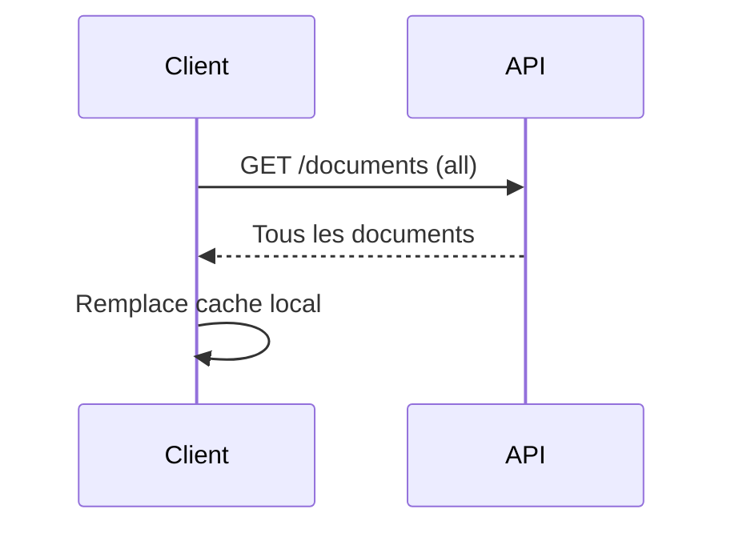
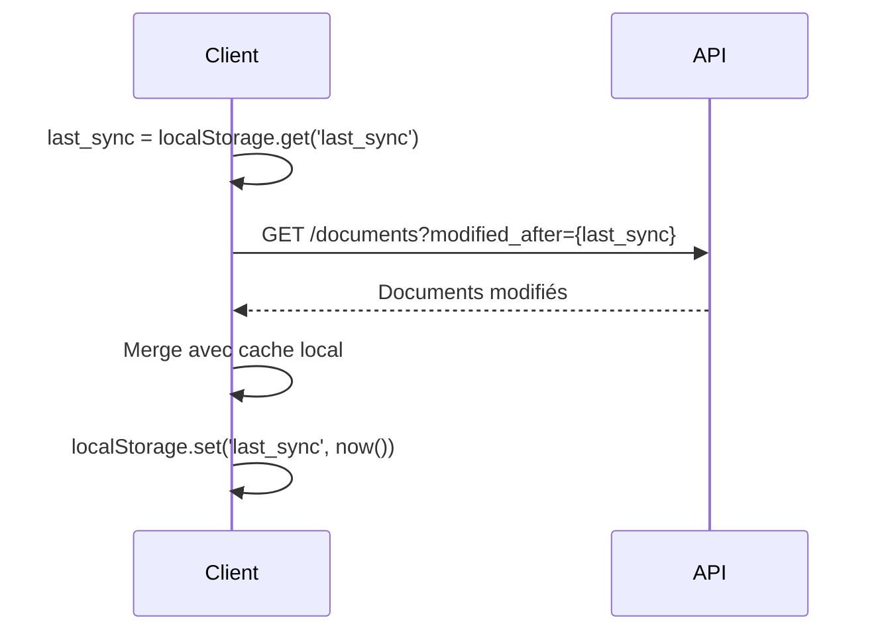
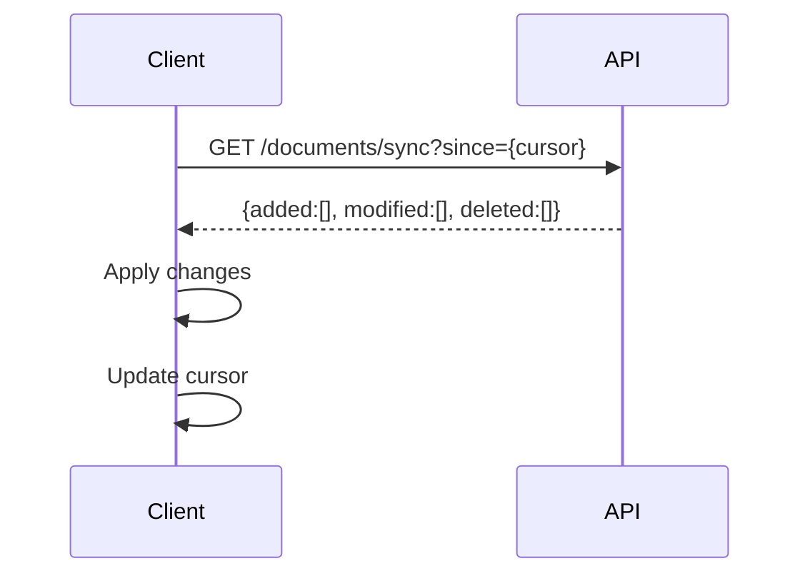

# Plan de Synchronisation des Documents

## Vue d'ensemble

Ce document décrit la stratégie complète pour implémenter un système de synchronisation bidirectionnelle entre l'API backend et les applications clientes. L'objectif est de permettre aux clients de télécharger efficacement tous les nouveaux documents ainsi que ceux qui ont été modifiés depuis leur dernière synchronisation.

## Table des matières

1. [Analyse de l'existant](#analyse-de-lexistant)
2. [Stratégies de synchronisation](#stratégies-de-synchronisation)
3. [Approches d'implémentation](#approches-dimplémentation)
4. [Modifications côté serveur](#modifications-côté-serveur)
5. [Implémentation côté client](#implémentation-côté-client)
6. [Gestion des conflits](#gestion-des-conflits)
7. [Optimisations et performances](#optimisations-et-performances)
8. [Sécurité](#sécurité)
9. [Monitoring et logs](#monitoring-et-logs)
10. [Plan de migration](#plan-de-migration)

## Analyse de l'existant

### Modèles de données actuels

#### Document (Tenant DB)
```python
- id (UUID)
- filename (String, 255)
- mime_type (String, 100)
- file_id (UUID, FK)
- user_id (UUID)
- created_at (DateTime, UTC)
- updated_at (DateTime, UTC)  # Auto-mis à jour sur modification
- created_by (UUID)
```

#### File (Tenant DB)
```python
- id (UUID)
- md5_hash (String, 32)  # Déduplication
- sha256_hash (String, 64)  # TSA timestamping
- s3_path (String, 500)
- file_size (BigInteger)
- file_metadata (JSONB)
- created_at (DateTime, UTC)
- updated_at (DateTime, UTC)
- created_by (UUID)
```

### Endpoint actuel : list_documents

```http
GET /api/tenants/{tenant_id}/documents?page=1&per_page=20&filename=report
```

**Limitations actuelles :**
- Pas de filtrage par date de modification
- Pas de détection des suppressions
- Pas de synchronisation incrémentale
- Pagination uniquement par offset (pas de curseur)

## Stratégies de synchronisation

### 1. Synchronisation complète (Full Sync)

Télécharge tous les documents à chaque fois. Simple mais inefficace.



**Avantages :**
- Simple à implémenter
- Pas de gestion d'état
- Garantit la cohérence

**Inconvénients :**
- Consomme beaucoup de bande passante
- Lent pour de gros volumes
- Charge serveur importante

### 2. Synchronisation incrémentale par timestamp

Ne télécharge que les documents modifiés depuis la dernière synchronisation.



**Avantages :**
- Économe en bande passante
- Rapide pour les mises à jour fréquentes
- Charge serveur réduite

**Inconvénients :**
- Ne détecte pas les suppressions
- Problèmes si horloges désynchronisées
- Peut rater des changements si crash pendant sync

### 3. Synchronisation delta avec soft-delete

Suit les créations, modifications ET suppressions.



**Avantages :**
- Synchronisation complète et fiable
- Détecte toutes les modifications
- Permet rollback et audit

**Inconvénients :**
- Plus complexe à implémenter
- Nécessite modification du schéma DB
- Augmente la taille de la base de données

## Approches d'implémentation

### Niveau 1 : Synchronisation simple (Quick Win)

Ajouter des paramètres de filtrage temporel à l'endpoint existant.

#### Modifications backend

```python
# backend/app/routes/documents.py
@documents_bp.route('/<tenant_id>/documents', methods=['GET'])
@jwt_required_custom
def list_documents(tenant_id: str):
    # ... existing code ...

    # Nouveaux paramètres
    modified_after = request.args.get('modified_after', None, type=str)
    modified_before = request.args.get('modified_before', None, type=str)
    created_after = request.args.get('created_after', None, type=str)

    with tenant_db_manager.tenant_db_session(database_name) as session:
        query = session.query(Document)

        # Filtres temporels
        if modified_after:
            modified_after_dt = datetime.fromisoformat(modified_after.replace('Z', '+00:00'))
            query = query.filter(Document.updated_at > modified_after_dt)

        if modified_before:
            modified_before_dt = datetime.fromisoformat(modified_before.replace('Z', '+00:00'))
            query = query.filter(Document.updated_at <= modified_before_dt)

        if created_after:
            created_after_dt = datetime.fromisoformat(created_after.replace('Z', '+00:00'))
            query = query.filter(Document.created_at > created_after_dt)

        # ... rest of existing code ...
```

#### Utilisation client

```javascript
// Client JavaScript/TypeScript
class DocumentSync {
    constructor(apiClient) {
        this.apiClient = apiClient;
        this.lastSyncTime = localStorage.getItem('lastSyncTime') || null;
    }

    async syncDocuments(tenantId) {
        const params = {};

        if (this.lastSyncTime) {
            // Synchronisation incrémentale
            params.modified_after = this.lastSyncTime;
        }

        try {
            const response = await this.apiClient.get(
                `/api/tenants/${tenantId}/documents`,
                { params }
            );

            // Traiter les documents
            for (const doc of response.data.documents) {
                await this.processDocument(doc);
            }

            // Mettre à jour le timestamp
            this.lastSyncTime = new Date().toISOString();
            localStorage.setItem('lastSyncTime', this.lastSyncTime);

            return response.data.documents.length;
        } catch (error) {
            console.error('Sync failed:', error);
            throw error;
        }
    }

    async processDocument(doc) {
        // Vérifier si le document existe localement
        const localDoc = await this.getLocalDocument(doc.id);

        if (!localDoc || localDoc.updated_at < doc.updated_at) {
            // Télécharger le fichier
            await this.downloadFile(doc);
            // Sauvegarder les métadonnées
            await this.saveLocalDocument(doc);
        }
    }
}
```

### Niveau 2 : Synchronisation avec soft-delete

Ajouter le support des suppressions logiques pour une synchronisation complète.

#### Migration de base de données

```python
# backend/app/tenant_db/tenant_migrations.py

@register_migration(4)
def add_soft_delete_to_documents(db):
    """Add soft delete columns to documents table for sync support"""
    db.execute(text("""
        ALTER TABLE documents
        ADD COLUMN IF NOT EXISTS is_deleted BOOLEAN DEFAULT FALSE,
        ADD COLUMN IF NOT EXISTS deleted_at TIMESTAMP WITH TIME ZONE,
        ADD COLUMN IF NOT EXISTS deleted_by UUID;

        -- Index pour requêtes efficaces
        CREATE INDEX IF NOT EXISTS idx_documents_updated_at
        ON documents(updated_at DESC);

        CREATE INDEX IF NOT EXISTS idx_documents_deleted_at
        ON documents(deleted_at)
        WHERE is_deleted = TRUE;

        CREATE INDEX IF NOT EXISTS idx_documents_sync
        ON documents(updated_at, created_at, is_deleted);
    """))
```

#### Nouvel endpoint de synchronisation

```python
# backend/app/routes/documents.py

@documents_bp.route('/<tenant_id>/documents/sync', methods=['GET'])
@jwt_required_custom
def sync_documents(tenant_id: str):
    """
    Synchronization endpoint that returns changes since a given timestamp.

    Query Parameters:
        since: ISO 8601 timestamp (required)
        include_deleted: boolean (default: true)
        page: int (default: 1)
        per_page: int (default: 100, max: 500)

    Response:
        {
            "success": true,
            "data": {
                "added": [...],     # Documents créés après 'since'
                "modified": [...],  # Documents modifiés après 'since'
                "deleted": [...],   # Documents supprimés après 'since'
                "sync_token": "...", # Token pour la prochaine sync
                "has_more": false,
                "next_page": null
            }
        }
    """
    try:
        user_id = g.user_id

        # Validation des paramètres
        since = request.args.get('since', type=str)
        if not since:
            return bad_request('Parameter "since" is required')

        try:
            since_dt = datetime.fromisoformat(since.replace('Z', '+00:00'))
        except ValueError:
            return bad_request('Invalid "since" timestamp format')

        include_deleted = request.args.get('include_deleted', True, type=bool)
        page = request.args.get('page', 1, type=int)
        per_page = min(request.args.get('per_page', 100, type=int), 500)

        # Vérifier l'accès au tenant
        has_access, error_response = check_tenant_access(user_id, tenant_id)
        if not has_access:
            return error_response

        tenant = Tenant.query.get(tenant_id)

        with tenant_db_manager.tenant_db_session(tenant.database_name) as session:
            # Documents ajoutés (créés après 'since')
            added_query = session.query(Document).filter(
                Document.created_at > since_dt,
                Document.is_deleted == False
            )

            # Documents modifiés (mis à jour après 'since' mais créés avant)
            modified_query = session.query(Document).filter(
                Document.updated_at > since_dt,
                Document.created_at <= since_dt,
                Document.is_deleted == False
            )

            # Documents supprimés
            deleted_query = session.query(Document).filter(
                Document.deleted_at > since_dt,
                Document.is_deleted == True
            ) if include_deleted else None

            # Appliquer la pagination
            offset = (page - 1) * per_page

            added = added_query.limit(per_page).offset(offset).all()
            modified = modified_query.limit(per_page).offset(offset).all()
            deleted = deleted_query.limit(per_page).offset(offset).all() if deleted_query else []

            # Vérifier s'il y a plus de données
            total_changes = len(added) + len(modified) + len(deleted)
            has_more = total_changes == per_page

            # Générer un token de synchronisation
            sync_token = base64.b64encode(
                f"{datetime.utcnow().isoformat()}:{page}".encode()
            ).decode()

            # Préparer la réponse
            response_data = {
                'added': [doc.to_dict(include_file=True) for doc in added],
                'modified': [doc.to_dict(include_file=True) for doc in modified],
                'deleted': [{'id': str(doc.id), 'deleted_at': doc.deleted_at.isoformat()}
                          for doc in deleted],
                'sync_token': sync_token,
                'has_more': has_more,
                'next_page': page + 1 if has_more else None
            }

            logger.info(
                f"Sync request: tenant={tenant_id}, since={since}, "
                f"added={len(added)}, modified={len(modified)}, deleted={len(deleted)}"
            )

            return ok(response_data, 'Sync data retrieved successfully')

    except Exception as e:
        logger.error(f"Error in sync_documents: {str(e)}", exc_info=True)
        return internal_error('Failed to retrieve sync data')
```

#### Modification de la suppression

```python
# backend/app/routes/documents.py

@documents_bp.route('/<tenant_id>/documents/<document_id>', methods=['DELETE'])
@jwt_required_custom
def delete_document(tenant_id: str, document_id: str):
    """
    Soft delete document (for sync support)
    Use DELETE with ?hard=true for permanent deletion
    """
    try:
        user_id = g.user_id
        hard_delete = request.args.get('hard', False, type=bool)

        # ... validation code ...

        with tenant_db_manager.tenant_db_session(database_name) as session:
            document = session.query(Document).filter_by(id=document_id).first()

            if not document:
                return not_found('Document not found')

            if hard_delete:
                # Suppression définitive (ancien comportement)
                session.delete(document)
            else:
                # Soft delete pour la synchronisation
                document.is_deleted = True
                document.deleted_at = datetime.utcnow()
                document.deleted_by = user_id

            session.flush()

            return ok({
                'deleted_document_id': str(document_id),
                'hard_delete': hard_delete
            }, 'Document deleted successfully')

    except Exception as e:
        logger.error(f"Error deleting document: {str(e)}", exc_info=True)
        return internal_error('Failed to delete document')
```

### Niveau 3 : Synchronisation avancée avec curseur

Implémentation robuste avec gestion des edge cases et optimisations.

#### Client avancé avec gestion d'état

```typescript
// Client TypeScript avec gestion complète de la synchronisation

interface SyncState {
    cursor: string | null;
    lastSyncTime: string | null;
    pendingChanges: DocumentChange[];
    syncInProgress: boolean;
}

interface DocumentChange {
    type: 'added' | 'modified' | 'deleted';
    document: Document;
    timestamp: string;
}

class AdvancedDocumentSync {
    private state: SyncState;
    private db: LocalDatabase;
    private api: ApiClient;
    private conflictResolver: ConflictResolver;

    constructor(api: ApiClient, db: LocalDatabase) {
        this.api = api;
        this.db = db;
        this.state = this.loadState();
        this.conflictResolver = new ConflictResolver();
    }

    async performSync(tenantId: string): Promise<SyncResult> {
        if (this.state.syncInProgress) {
            throw new Error('Sync already in progress');
        }

        this.state.syncInProgress = true;
        const result: SyncResult = {
            added: 0,
            modified: 0,
            deleted: 0,
            conflicts: 0,
            errors: []
        };

        try {
            // 1. Envoyer les changements locaux en attente
            if (this.state.pendingChanges.length > 0) {
                await this.uploadPendingChanges(tenantId);
            }

            // 2. Récupérer les changements du serveur
            let hasMore = true;
            let page = 1;

            while (hasMore) {
                const response = await this.api.get(
                    `/api/tenants/${tenantId}/documents/sync`,
                    {
                        params: {
                            since: this.state.lastSyncTime || '1970-01-01T00:00:00Z',
                            page,
                            per_page: 100
                        }
                    }
                );

                const data = response.data.data;

                // 3. Traiter les documents ajoutés
                for (const doc of data.added) {
                    try {
                        await this.processAddedDocument(doc);
                        result.added++;
                    } catch (error) {
                        result.errors.push({
                            documentId: doc.id,
                            error: error.message,
                            type: 'added'
                        });
                    }
                }

                // 4. Traiter les documents modifiés
                for (const doc of data.modified) {
                    try {
                        const conflict = await this.processModifiedDocument(doc);
                        if (conflict) {
                            result.conflicts++;
                        } else {
                            result.modified++;
                        }
                    } catch (error) {
                        result.errors.push({
                            documentId: doc.id,
                            error: error.message,
                            type: 'modified'
                        });
                    }
                }

                // 5. Traiter les suppressions
                for (const deletion of data.deleted) {
                    try {
                        await this.processDeletedDocument(deletion.id);
                        result.deleted++;
                    } catch (error) {
                        result.errors.push({
                            documentId: deletion.id,
                            error: error.message,
                            type: 'deleted'
                        });
                    }
                }

                // Mise à jour du curseur
                this.state.cursor = data.sync_token;
                hasMore = data.has_more;
                page = data.next_page || page + 1;

                // Sauvegarder l'état après chaque page
                this.saveState();
            }

            // 6. Mettre à jour le timestamp de dernière sync
            this.state.lastSyncTime = new Date().toISOString();
            this.saveState();

            return result;

        } catch (error) {
            console.error('Sync failed:', error);
            throw error;
        } finally {
            this.state.syncInProgress = false;
        }
    }

    private async processAddedDocument(doc: Document): Promise<void> {
        // Télécharger le fichier
        const fileData = await this.downloadFile(doc);

        // Vérifier l'intégrité avec MD5
        const calculatedMd5 = await this.calculateMd5(fileData);
        if (calculatedMd5 !== doc.file.md5_hash) {
            throw new Error(`MD5 mismatch for document ${doc.id}`);
        }

        // Sauvegarder localement
        await this.db.saveDocument(doc);
        await this.db.saveFile(doc.file_id, fileData);
    }

    private async processModifiedDocument(doc: Document): Promise<boolean> {
        const localDoc = await this.db.getDocument(doc.id);

        if (!localDoc) {
            // Pas de version locale, traiter comme ajout
            await this.processAddedDocument(doc);
            return false;
        }

        // Vérifier les conflits
        if (localDoc.locallyModified && localDoc.updated_at !== doc.updated_at) {
            // Conflit détecté
            const resolution = await this.conflictResolver.resolve(localDoc, doc);

            switch (resolution.action) {
                case 'keep_local':
                    // Garder la version locale, ajouter aux changements en attente
                    this.state.pendingChanges.push({
                        type: 'modified',
                        document: localDoc,
                        timestamp: new Date().toISOString()
                    });
                    break;

                case 'keep_remote':
                    // Accepter la version serveur
                    await this.processAddedDocument(doc);
                    break;

                case 'merge':
                    // Fusionner les changements
                    const merged = resolution.mergedDocument;
                    await this.db.saveDocument(merged);
                    this.state.pendingChanges.push({
                        type: 'modified',
                        document: merged,
                        timestamp: new Date().toISOString()
                    });
                    break;
            }

            return true; // Conflit traité
        }

        // Pas de conflit, mettre à jour
        await this.processAddedDocument(doc);
        return false;
    }

    private async processDeletedDocument(documentId: string): Promise<void> {
        const localDoc = await this.db.getDocument(documentId);

        if (localDoc && localDoc.locallyModified) {
            // Le document a été modifié localement mais supprimé sur le serveur
            // Politique : recréer sur le serveur
            this.state.pendingChanges.push({
                type: 'added',
                document: localDoc,
                timestamp: new Date().toISOString()
            });
        } else {
            // Supprimer localement
            await this.db.deleteDocument(documentId);
        }
    }

    private async downloadFile(doc: Document): Promise<ArrayBuffer> {
        // Obtenir l'URL de téléchargement
        const urlResponse = await this.api.get(
            `/api/tenants/${doc.tenant_id}/documents/${doc.id}/download-url`,
            {
                params: { expires_in: 3600 }
            }
        );

        // Télécharger le fichier
        const response = await fetch(urlResponse.data.data.download_url);
        return await response.arrayBuffer();
    }

    private async calculateMd5(data: ArrayBuffer): Promise<string> {
        const hashBuffer = await crypto.subtle.digest('MD5', data);
        const hashArray = Array.from(new Uint8Array(hashBuffer));
        return hashArray.map(b => b.toString(16).padStart(2, '0')).join('');
    }

    private saveState(): void {
        localStorage.setItem('syncState', JSON.stringify(this.state));
    }

    private loadState(): SyncState {
        const saved = localStorage.getItem('syncState');
        if (saved) {
            return JSON.parse(saved);
        }

        return {
            cursor: null,
            lastSyncTime: null,
            pendingChanges: [],
            syncInProgress: false
        };
    }
}
```

## Gestion des conflits

### Stratégies de résolution

1. **Last Write Wins (LWW)**
   - La modification la plus récente gagne
   - Simple mais peut perdre des données

2. **First Write Wins (FWW)**
   - La première modification est conservée
   - Évite les écrasements accidentels

3. **Manual Resolution**
   - L'utilisateur choisit quelle version garder
   - Plus complexe mais plus sûr

4. **Automatic Merge**
   - Fusionne les changements non conflictuels
   - Demande intervention pour les vrais conflits

### Implémentation de la résolution

```typescript
class ConflictResolver {
    async resolve(local: Document, remote: Document): Promise<Resolution> {
        // Stratégie par défaut : Last Write Wins
        if (remote.updated_at > local.updated_at) {
            return { action: 'keep_remote' };
        }

        // Si modifications identiques, pas de conflit
        if (this.areEqual(local, remote)) {
            return { action: 'keep_remote' };
        }

        // Si seuls les métadonnées diffèrent, fusionner
        if (local.file_id === remote.file_id) {
            const merged = {
                ...remote,
                filename: local.filename, // Garder le nom local
                updated_at: new Date().toISOString()
            };
            return { action: 'merge', mergedDocument: merged };
        }

        // Conflit réel, demander à l'utilisateur
        return await this.promptUser(local, remote);
    }
}
```

## Optimisations et performances

### 1. Pagination intelligente

```python
# Utiliser des curseurs au lieu d'offset pour la pagination
def create_cursor(last_item, page):
    """Créer un curseur opaque pour la pagination"""
    cursor_data = {
        'timestamp': last_item.updated_at.isoformat(),
        'id': str(last_item.id),
        'page': page
    }
    return base64.b64encode(json.dumps(cursor_data).encode()).decode()

def parse_cursor(cursor):
    """Parser un curseur de pagination"""
    try:
        data = json.loads(base64.b64decode(cursor))
        return data
    except:
        return None
```

### 2. Compression des réponses

```python
# backend/app/utils/compression.py
import gzip
from flask import Response

def compress_response(data):
    """Compresser la réponse si elle est volumineuse"""
    json_str = json.dumps(data)

    if len(json_str) > 1024:  # > 1KB
        compressed = gzip.compress(json_str.encode())
        return Response(
            compressed,
            headers={
                'Content-Encoding': 'gzip',
                'Content-Type': 'application/json'
            }
        )

    return Response(json_str, mimetype='application/json')
```

### 3. Batch downloads

```python
@documents_bp.route('/<tenant_id>/documents/batch-download', methods=['POST'])
@jwt_required_custom
def batch_download(tenant_id: str):
    """
    Télécharger plusieurs documents en une seule requête

    Body:
        {
            "document_ids": ["uuid1", "uuid2", ...],
            "format": "zip" | "tar"
        }

    Returns: Archive containing all requested files
    """
    # Implémentation du téléchargement par lot
    pass
```

### 4. Cache côté serveur

```python
# Utiliser Redis pour cacher les requêtes de sync fréquentes
from app.extensions import redis_client

def get_cached_sync_data(tenant_id, since, page):
    """Récupérer les données de sync depuis le cache"""
    cache_key = f"sync:{tenant_id}:{since}:{page}"
    cached = redis_client.get(cache_key)

    if cached:
        return json.loads(cached)

    return None

def cache_sync_data(tenant_id, since, page, data, ttl=300):
    """Mettre en cache les données de sync pour 5 minutes"""
    cache_key = f"sync:{tenant_id}:{since}:{page}"
    redis_client.setex(cache_key, ttl, json.dumps(data))
```

### 5. Delta compression

```javascript
// Client: Ne télécharger que les différences
class DeltaSync {
    async syncDocument(doc) {
        const local = await this.db.getDocument(doc.id);

        if (local && local.file.md5_hash === doc.file.md5_hash) {
            // Seules les métadonnées ont changé, pas besoin de télécharger le fichier
            await this.db.updateMetadata(doc);
            return;
        }

        // Fichier modifié, télécharger
        await this.downloadAndSave(doc);
    }
}
```

## Sécurité

### 1. Authentification et autorisation

```python
# Vérifier les permissions pour la synchronisation
def check_sync_permission(user_id, tenant_id):
    """Vérifier que l'utilisateur peut synchroniser"""
    association = UserTenantAssociation.query.filter_by(
        user_id=user_id,
        tenant_id=tenant_id
    ).first()

    if not association:
        return False

    # Seuls les utilisateurs avec permission 'read' peuvent synchroniser
    return association.has_permission('read')
```

### 2. Rate limiting

```python
from flask_limiter import Limiter

limiter = Limiter(
    key_func=lambda: g.user_id,
    storage_uri="redis://localhost:6379"
)

@documents_bp.route('/<tenant_id>/documents/sync')
@limiter.limit("100 per minute")  # Max 100 requêtes de sync par minute
@jwt_required_custom
def sync_documents(tenant_id: str):
    # ...
```

### 3. Validation des données

```python
# backend/app/schemas/sync_schema.py
from marshmallow import Schema, fields, validate, ValidationError

class SyncRequestSchema(Schema):
    """Schéma de validation pour les requêtes de synchronisation"""
    since = fields.DateTime(required=True, format='iso')
    page = fields.Integer(missing=1, validate=validate.Range(min=1))
    per_page = fields.Integer(
        missing=100,
        validate=validate.Range(min=1, max=500)
    )
    include_deleted = fields.Boolean(missing=True)

    @validates('since')
    def validate_since(self, value):
        """Vérifier que 'since' n'est pas dans le futur"""
        if value > datetime.utcnow():
            raise ValidationError("'since' cannot be in the future")

sync_request_schema = SyncRequestSchema()
```

### 4. Chiffrement des données sensibles

```javascript
// Client: Chiffrer les données locales
class SecureLocalStorage {
    private key: CryptoKey;

    async encrypt(data: any): Promise<string> {
        const json = JSON.stringify(data);
        const encoded = new TextEncoder().encode(json);
        const iv = crypto.getRandomValues(new Uint8Array(12));

        const encrypted = await crypto.subtle.encrypt(
            { name: 'AES-GCM', iv },
            this.key,
            encoded
        );

        // Combiner IV et données chiffrées
        const combined = new Uint8Array(iv.length + encrypted.byteLength);
        combined.set(iv, 0);
        combined.set(new Uint8Array(encrypted), iv.length);

        return btoa(String.fromCharCode(...combined));
    }

    async decrypt(encryptedData: string): Promise<any> {
        const combined = Uint8Array.from(atob(encryptedData), c => c.charCodeAt(0));
        const iv = combined.slice(0, 12);
        const data = combined.slice(12);

        const decrypted = await crypto.subtle.decrypt(
            { name: 'AES-GCM', iv },
            this.key,
            data
        );

        const json = new TextDecoder().decode(decrypted);
        return JSON.parse(json);
    }
}
```

## Monitoring et logs

### 1. Métriques de synchronisation

```python
# backend/app/utils/metrics.py
from prometheus_client import Counter, Histogram, Gauge

# Compteurs
sync_requests_total = Counter(
    'sync_requests_total',
    'Total sync requests',
    ['tenant_id', 'status']
)

sync_documents_total = Counter(
    'sync_documents_total',
    'Total documents synchronized',
    ['tenant_id', 'operation']  # added, modified, deleted
)

# Histogrammes
sync_duration_seconds = Histogram(
    'sync_duration_seconds',
    'Sync request duration',
    ['tenant_id']
)

# Jauges
sync_lag_seconds = Gauge(
    'sync_lag_seconds',
    'Time since last successful sync',
    ['tenant_id', 'user_id']
)

def record_sync_metrics(tenant_id, result, duration):
    """Enregistrer les métriques de synchronisation"""
    sync_requests_total.labels(tenant_id=tenant_id, status='success').inc()
    sync_duration_seconds.labels(tenant_id=tenant_id).observe(duration)

    for operation in ['added', 'modified', 'deleted']:
        count = getattr(result, operation, 0)
        if count > 0:
            sync_documents_total.labels(
                tenant_id=tenant_id,
                operation=operation
            ).inc(count)
```

### 2. Logs structurés

```python
import structlog

logger = structlog.get_logger()

def log_sync_event(event_type, **kwargs):
    """Logger les événements de synchronisation"""
    logger.info(
        event_type,
        tenant_id=kwargs.get('tenant_id'),
        user_id=kwargs.get('user_id'),
        documents_added=kwargs.get('added', 0),
        documents_modified=kwargs.get('modified', 0),
        documents_deleted=kwargs.get('deleted', 0),
        duration_ms=kwargs.get('duration_ms'),
        errors=kwargs.get('errors', []),
        timestamp=datetime.utcnow().isoformat()
    )
```

### 3. Alertes

```yaml
# prometheus/alerts.yml
groups:
  - name: sync_alerts
    rules:
      - alert: HighSyncErrorRate
        expr: rate(sync_requests_total{status="error"}[5m]) > 0.1
        for: 5m
        labels:
          severity: warning
        annotations:
          summary: "High sync error rate for tenant {{ $labels.tenant_id }}"

      - alert: SyncLagTooHigh
        expr: sync_lag_seconds > 3600
        for: 10m
        labels:
          severity: warning
        annotations:
          summary: "Sync lag > 1 hour for tenant {{ $labels.tenant_id }}"
```

### 4. Dashboard Grafana

```json
{
  "dashboard": {
    "title": "Document Sync Monitoring",
    "panels": [
      {
        "title": "Sync Requests Rate",
        "targets": [
          {
            "expr": "rate(sync_requests_total[5m])",
            "legendFormat": "{{ tenant_id }} - {{ status }}"
          }
        ]
      },
      {
        "title": "Documents Synchronized",
        "targets": [
          {
            "expr": "sum(rate(sync_documents_total[5m])) by (operation)",
            "legendFormat": "{{ operation }}"
          }
        ]
      },
      {
        "title": "Sync Duration (p95)",
        "targets": [
          {
            "expr": "histogram_quantile(0.95, rate(sync_duration_seconds_bucket[5m]))",
            "legendFormat": "p95"
          }
        ]
      }
    ]
  }
}
```

## Plan de migration

### Phase 1 : Préparation (Semaine 1)

1. **Backup complet** des bases de données
2. **Tests en environnement de staging**
3. **Documentation** pour les équipes
4. **Monitoring** en place

### Phase 2 : Déploiement backend (Semaine 2)

1. **Migration de base de données**
   ```bash
   # Appliquer la migration v4 (soft-delete)
   docker-compose exec api python scripts/migrate_all_tenants.py
   ```

2. **Déploiement du nouveau code**
   - Nouveaux endpoints de synchronisation
   - Support du soft-delete
   - Métriques et logs

3. **Tests de non-régression**
   - Vérifier que les anciens endpoints fonctionnent
   - Tester la rétrocompatibilité

### Phase 3 : Migration progressive des clients (Semaines 3-4)

1. **Feature flag** pour activer la nouvelle sync
   ```javascript
   const ENABLE_NEW_SYNC = localStorage.getItem('feature_new_sync') === 'true';

   if (ENABLE_NEW_SYNC) {
       await advancedSync.performSync();
   } else {
       await legacySync.sync();
   }
   ```

2. **Rollout progressif**
   - 10% des utilisateurs (jour 1)
   - 25% des utilisateurs (jour 3)
   - 50% des utilisateurs (jour 5)
   - 100% des utilisateurs (jour 7)

3. **Monitoring des métriques**
   - Taux d'erreur
   - Performance
   - Utilisation de la bande passante

### Phase 4 : Optimisations (Semaine 5)

1. **Analyse des patterns d'usage**
2. **Ajustement des paramètres**
   - Taille des pages
   - TTL du cache
   - Limites de rate limiting
3. **Optimisations de requêtes**

### Phase 5 : Nettoyage (Semaine 6)

1. **Retirer le code legacy**
2. **Nettoyer les données obsolètes**
3. **Documentation finale**
4. **Post-mortem**

## Scripts de test

### Test de synchronisation basique

```bash
#!/bin/bash
# test_sync.sh

API_URL="http://localhost:4999"
TENANT_ID="your-tenant-id"
TOKEN="your-jwt-token"

# 1. Première synchronisation (récupérer tout)
echo "=== Initial sync ==="
curl -X GET \
  "${API_URL}/api/tenants/${TENANT_ID}/documents/sync?since=1970-01-01T00:00:00Z" \
  -H "Authorization: Bearer ${TOKEN}" \
  -H "Content-Type: application/json" \
  | jq '.'

# 2. Créer un nouveau document
echo "=== Creating new document ==="
curl -X POST \
  "${API_URL}/api/tenants/${TENANT_ID}/documents" \
  -H "Authorization: Bearer ${TOKEN}" \
  -F "file=@test.pdf" \
  -F "filename=test.pdf" \
  -F "mime_type=application/pdf"

# 3. Attendre 2 secondes
sleep 2

# 4. Synchronisation incrémentale
LAST_SYNC=$(date -u -d '2 seconds ago' '+%Y-%m-%dT%H:%M:%SZ')
echo "=== Incremental sync since ${LAST_SYNC} ==="
curl -X GET \
  "${API_URL}/api/tenants/${TENANT_ID}/documents/sync?since=${LAST_SYNC}" \
  -H "Authorization: Bearer ${TOKEN}" \
  -H "Content-Type: application/json" \
  | jq '.'
```

### Test de performance

```python
#!/usr/bin/env python3
# test_sync_performance.py

import asyncio
import aiohttp
import time
import statistics
from datetime import datetime, timedelta

async def test_sync_performance(
    session: aiohttp.ClientSession,
    tenant_id: str,
    token: str,
    num_requests: int = 100
):
    """Tester la performance de l'endpoint de synchronisation"""

    url = f"http://localhost:4999/api/tenants/{tenant_id}/documents/sync"
    headers = {"Authorization": f"Bearer {token}"}

    # Timestamp pour récupérer les dernières 24h
    since = (datetime.utcnow() - timedelta(days=1)).isoformat() + 'Z'

    durations = []

    for i in range(num_requests):
        start = time.time()

        async with session.get(
            url,
            headers=headers,
            params={"since": since}
        ) as response:
            await response.json()

        duration = time.time() - start
        durations.append(duration)

        if i % 10 == 0:
            print(f"Progress: {i}/{num_requests}")

    # Calculer les statistiques
    print(f"\n=== Performance Statistics ({num_requests} requests) ===")
    print(f"Min: {min(durations):.3f}s")
    print(f"Max: {max(durations):.3f}s")
    print(f"Mean: {statistics.mean(durations):.3f}s")
    print(f"Median: {statistics.median(durations):.3f}s")
    print(f"Stdev: {statistics.stdev(durations):.3f}s")
    print(f"P95: {statistics.quantiles(durations, n=20)[18]:.3f}s")
    print(f"P99: {statistics.quantiles(durations, n=100)[98]:.3f}s")

async def main():
    tenant_id = "your-tenant-id"
    token = "your-jwt-token"

    async with aiohttp.ClientSession() as session:
        await test_sync_performance(session, tenant_id, token)

if __name__ == "__main__":
    asyncio.run(main())
```

### Test de conflit

```javascript
// test_conflict.js
// Tester la gestion des conflits de synchronisation

async function testConflictResolution() {
    const api = new ApiClient();
    const sync1 = new AdvancedDocumentSync(api, db1);
    const sync2 = new AdvancedDocumentSync(api, db2);

    // 1. Les deux clients téléchargent le même document
    await sync1.performSync(tenantId);
    await sync2.performSync(tenantId);

    // 2. Client 1 modifie le document
    const doc1 = await db1.getDocument(documentId);
    doc1.filename = "Modified by Client 1";
    await db1.saveDocument(doc1);

    // 3. Client 2 modifie le même document
    const doc2 = await db2.getDocument(documentId);
    doc2.filename = "Modified by Client 2";
    await db2.saveDocument(doc2);

    // 4. Client 1 synchronise (devrait réussir)
    const result1 = await sync1.performSync(tenantId);
    console.log("Client 1 sync:", result1);

    // 5. Client 2 synchronise (devrait détecter un conflit)
    const result2 = await sync2.performSync(tenantId);
    console.log("Client 2 sync:", result2);
    console.log("Conflicts detected:", result2.conflicts);
}
```

## Conclusion

Ce plan de synchronisation fournit une approche progressive pour implémenter un système robuste de synchronisation de documents. Les trois niveaux proposés permettent de commencer simplement et d'évoluer vers une solution plus sophistiquée selon les besoins.

### Recommandations

1. **Commencer par le Niveau 1** (synchronisation simple par timestamp) pour une mise en œuvre rapide
2. **Évoluer vers le Niveau 2** (soft-delete) quand la détection des suppressions devient nécessaire
3. **Implémenter le Niveau 3** (curseur et optimisations) pour les déploiements à grande échelle

### Points clés à retenir

- La synchronisation incrémentale réduit drastiquement la bande passante
- Le soft-delete est essentiel pour une synchronisation bidirectionnelle complète
- La gestion des conflits doit être définie selon les besoins métier
- Le monitoring est crucial pour détecter et résoudre les problèmes
- Les tests de performance doivent être effectués avant la mise en production

### Prochaines étapes

1. Valider l'approche avec l'équipe
2. Choisir le niveau d'implémentation initial
3. Créer un POC (Proof of Concept)
4. Définir les métriques de succès
5. Planifier le déploiement progressif