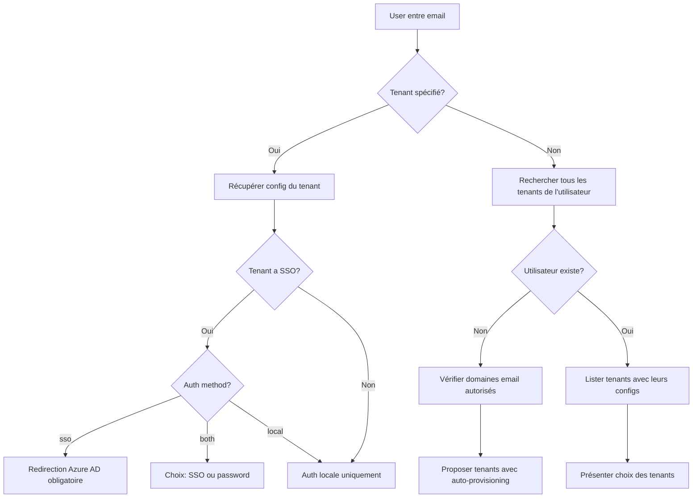

# Plan d'implémentation Azure SSO Multi-Tenant (Mode Public Application)

> **⚠️ IMPORTANT**: Cette implémentation utilise exclusivement le mode **Public Application** d'Azure AD/Microsoft Entra ID.
> - **Pas de client_secret** à gérer ou stocker
> - Utilisation de **PKCE** (Proof Key for Code Exchange) pour sécuriser le flow OAuth2
> - Configuration simplifiée : seulement `client_id` et `azure_tenant_id` requis
> - Idéal pour les SPA (Single Page Applications) et applications mobiles

## Contexte

L'application SaaS actuelle utilise une architecture multi-tenant où :
- Les utilisateurs peuvent avoir des rôles sur un ou plusieurs tenants
- L'authentification actuelle est basée sur email/password avec JWT
- Certains tenants souhaitent permettre à leurs utilisateurs de se connecter via Azure Active Directory SSO

## Objectifs

1. Permettre à certains tenants d'activer Azure AD SSO pour leurs utilisateurs
2. Conserver l'authentification email/password pour les tenants qui le souhaitent
3. Supporter un mode hybride (SSO + local) pour une transition progressive
4. Maintenir la compatibilité totale avec le système existant

## Architecture proposée

### 1. Modèle de données - Configuration SSO Multi-Tenant

> **⚠️ Principe fondamental** : Un même utilisateur (identifié par son email) peut appartenir à plusieurs tenants, chacun pouvant avoir sa propre instance Azure AD. Par conséquent, un utilisateur aura potentiellement différents `azure_object_id` selon le tenant Azure AD qui l'authentifie.

#### Nouveau modèle : `TenantSSOConfig` (app/models/tenant_sso_config.py)

```python
from app import db
from sqlalchemy.dialects.postgresql import UUID, JSONB
import uuid
from datetime import datetime

class TenantSSOConfig(db.Model):
    """
    Configuration SSO pour chaque tenant.
    Chaque tenant peut avoir sa propre configuration Azure AD.
    Utilise le mode "Application publique" (Public Client) sans client_secret.
    """
    __tablename__ = 'tenant_sso_configs'

    id = db.Column(UUID(as_uuid=True), primary_key=True, default=uuid.uuid4)
    tenant_id = db.Column(UUID(as_uuid=True), db.ForeignKey('tenants.id', ondelete='CASCADE'), nullable=False)
    provider_type = db.Column(db.String(50), nullable=False, default='azure_ad')

    # Configuration Azure AD spécifique au tenant (mode Public Application)
    azure_tenant_id = db.Column(db.String(255), nullable=False)  # GUID ou domaine: 12345678-1234-1234-1234-123456789abc ou contoso.onmicrosoft.com
    client_id = db.Column(db.String(255), nullable=False)  # Application (client) ID depuis Azure Portal
    redirect_uri = db.Column(db.String(500), nullable=False)

    is_enabled = db.Column(db.Boolean, default=False)
    metadata = db.Column(JSONB)  # Config additionnelle (role mapping, auto-provisioning, etc.)

    created_at = db.Column(db.DateTime(timezone=True), default=datetime.utcnow)
    updated_at = db.Column(db.DateTime(timezone=True), default=datetime.utcnow, onupdate=datetime.utcnow)

    # Contrainte d'unicité : un seul provider par tenant
    __table_args__ = (
        db.UniqueConstraint('tenant_id', 'provider_type', name='_tenant_provider_uc'),
    )

    # Relations
    tenant = db.relationship('Tenant', back_populates='sso_config')
```

#### Nouveau modèle : `UserAzureIdentity` (app/models/user_azure_identity.py)

```python
from app import db
from sqlalchemy.dialects.postgresql import UUID
import uuid
from datetime import datetime

class UserAzureIdentity(db.Model):
    """
    Table de liaison entre utilisateurs et leurs identités Azure AD par tenant.
    Un utilisateur peut avoir différents Object IDs selon le tenant Azure AD.
    """
    __tablename__ = 'user_azure_identities'

    id = db.Column(UUID(as_uuid=True), primary_key=True, default=uuid.uuid4)
    user_id = db.Column(UUID(as_uuid=True), db.ForeignKey('users.id', ondelete='CASCADE'), nullable=False)
    tenant_id = db.Column(UUID(as_uuid=True), db.ForeignKey('tenants.id', ondelete='CASCADE'), nullable=False)

    # Identifiants Azure AD spécifiques à ce tenant
    azure_object_id = db.Column(db.String(255), nullable=False)  # Object ID dans l'Azure AD du tenant
    azure_tenant_id = db.Column(db.String(255), nullable=False)  # ID du tenant Azure AD
    azure_upn = db.Column(db.String(255))  # UserPrincipalName dans Azure AD
    azure_display_name = db.Column(db.String(255))  # Nom d'affichage dans Azure AD

    last_sync = db.Column(db.DateTime(timezone=True), default=datetime.utcnow)
    created_at = db.Column(db.DateTime(timezone=True), default=datetime.utcnow)
    updated_at = db.Column(db.DateTime(timezone=True), default=datetime.utcnow, onupdate=datetime.utcnow)

    # Contraintes et index
    __table_args__ = (
        # Un utilisateur ne peut avoir qu'une seule identité Azure par tenant
        db.UniqueConstraint('user_id', 'tenant_id', name='_user_tenant_azure_uc'),
        # Index pour recherche rapide par Azure Object ID
        db.Index('idx_azure_identity_lookup', 'azure_object_id', 'azure_tenant_id'),
    )

    # Relations
    user = db.relationship('User', back_populates='azure_identities')
    tenant = db.relationship('Tenant')

    @classmethod
    def find_or_create(cls, user_id, tenant_id, azure_object_id, azure_tenant_id, **kwargs):
        """Trouve ou crée une identité Azure pour un utilisateur sur un tenant"""
        identity = cls.query.filter_by(
            user_id=user_id,
            tenant_id=tenant_id
        ).first()

        if not identity:
            identity = cls(
                user_id=user_id,
                tenant_id=tenant_id,
                azure_object_id=azure_object_id,
                azure_tenant_id=azure_tenant_id,
                **kwargs
            )
            db.session.add(identity)

        return identity
```

#### Modèle complet `Tenant` (app/models/tenant.py)

```python
from app import db
from sqlalchemy.dialects.postgresql import UUID, ARRAY, JSONB
import uuid
from datetime import datetime

class Tenant(db.Model):
    """Modèle Tenant avec support SSO intégré"""
    __tablename__ = 'tenants'

    # Colonnes existantes
    id = db.Column(UUID(as_uuid=True), primary_key=True, default=uuid.uuid4)
    name = db.Column(db.String(100), nullable=False)
    slug = db.Column(db.String(100), unique=True, nullable=False)
    is_active = db.Column(db.Boolean, default=True)
    created_at = db.Column(db.DateTime(timezone=True), default=datetime.utcnow)
    updated_at = db.Column(db.DateTime(timezone=True), default=datetime.utcnow, onupdate=datetime.utcnow)

    # Nouvelles colonnes pour SSO
    auth_method = db.Column(db.String(20), default='local', nullable=False)
    # Valeurs: 'local' (password only), 'sso' (SSO only), 'both' (SSO + password)

    sso_domain_whitelist = db.Column(ARRAY(db.String), default=list)
    # Domaines email autorisés pour SSO (ex: ['@company.com'])

    sso_auto_provisioning = db.Column(db.Boolean, default=False)
    # Création automatique des utilisateurs lors du premier login SSO

    sso_default_role = db.Column(db.String(20), default='viewer')
    # Rôle par défaut pour les nouveaux utilisateurs SSO

    # Relations
    sso_config = db.relationship('TenantSSOConfig',
                                 back_populates='tenant',
                                 uselist=False,
                                 cascade='all, delete-orphan')
    user_associations = db.relationship('UserTenantAssociation',
                                        back_populates='tenant',
                                        cascade='all, delete-orphan')
```

#### Modèle complet `User` (app/models/user.py)

```python
from app import db
from sqlalchemy.dialects.postgresql import UUID, JSONB
import uuid
from datetime import datetime

class User(db.Model):
    """Modèle User avec support SSO intégré"""
    __tablename__ = 'users'

    # Colonnes existantes
    id = db.Column(UUID(as_uuid=True), primary_key=True, default=uuid.uuid4)
    email = db.Column(db.String(255), unique=True, nullable=False)
    password_hash = db.Column(db.String(255), nullable=True)  # Nullable pour SSO-only users
    first_name = db.Column(db.String(100))
    last_name = db.Column(db.String(100))
    is_active = db.Column(db.Boolean, default=True)
    created_at = db.Column(db.DateTime(timezone=True), default=datetime.utcnow)
    updated_at = db.Column(db.DateTime(timezone=True), default=datetime.utcnow, onupdate=datetime.utcnow)

    # Nouvelles colonnes pour SSO
    auth_provider = db.Column(db.String(50), default='local')
    # Dernier mode d'authentification utilisé: 'local' ou 'azure_ad'

    last_sso_login = db.Column(db.DateTime(timezone=True))
    # Dernière connexion SSO (tous tenants confondus)

    sso_metadata = db.Column(JSONB)
    # Métadonnées SSO globales (préférences, attributs synchronisés, etc.)

    # Relations
    azure_identities = db.relationship('UserAzureIdentity',
                                       back_populates='user',
                                       cascade='all, delete-orphan')
    tenant_associations = db.relationship('UserTenantAssociation',
                                          back_populates='user',
                                          cascade='all, delete-orphan')
```

### 2. Services Azure SSO

#### Structure des fichiers

```
backend/app/
├── models/
│   └── tenant_sso_config.py     # Nouveau modèle
├── services/
│   ├── azure_sso_service.py     # Service principal Azure AD
│   └── sso_manager.py           # Gestionnaire SSO multi-provider
├── routes/
│   └── sso.py                   # Routes SSO
└── utils/
    └── sso_validators.py        # Validation et helpers SSO
```

#### Service AzureSSOService

```python
import msal
from flask import session
import secrets

class AzureSSOService:
    """
    Gère l'authentification Azure AD via MSAL en mode Public Application.
    Utilise PKCE (Proof Key for Code Exchange) pour sécuriser le flow OAuth2.
    Ne nécessite PAS de client_secret.
    """

    def __init__(self, tenant_id: str):
        """
        Initialise le service pour un tenant spécifique
        Récupère la configuration Azure AD depuis tenant_sso_configs
        """
        self.tenant_id = tenant_id
        self.config = TenantSSOConfigService.get_azure_config(tenant_id)

        # Initialisation MSAL en mode Public Client (sans client_secret)
        self.app = msal.PublicClientApplication(
            client_id=self.config['client_id'],
            authority=f"https://login.microsoftonline.com/{self.config['azure_tenant_id']}"
        )

    def get_auth_url(self) -> dict:
        """
        Génère l'URL de redirection vers Azure AD du tenant avec PKCE.
        Retourne le flow complet qui doit être stocké pour le callback.
        """
        # Initier le flow d'autorisation avec PKCE
        flow = self.app.initiate_auth_code_flow(
            scopes=["User.Read", "email", "openid", "profile"],
            redirect_uri=self.config['redirect_uri'],
            state=self._generate_state_token()
        )

        # Stocker le flow en session ou cache (Redis) pour le callback
        # Le flow contient le code_verifier nécessaire pour PKCE
        self._store_auth_flow(flow)

        return {
            'auth_url': flow['auth_uri'],
            'flow_id': flow.get('state')  # Identifiant unique du flow
        }

    def exchange_code_for_token(self, auth_response: dict) -> dict:
        """
        Échange le code d'autorisation contre un token en utilisant PKCE.
        auth_response doit contenir le code et le state de la réponse Azure AD.
        """
        # Récupérer le flow stocké via le state
        flow = self._get_stored_flow(auth_response.get('state'))

        if not flow:
            raise ValueError("Invalid or expired authentication flow")

        # Échanger le code en utilisant le flow avec PKCE
        result = self.app.acquire_token_by_auth_code_flow(
            auth_code_flow=flow,
            auth_response=auth_response
        )

        # Nettoyer le flow stocké
        self._delete_stored_flow(auth_response.get('state'))

        return result

    def validate_token(self, token: str) -> dict:
        """Valide et décode le token Azure AD"""
        # Validation côté serveur des tokens ID
        # Utilise les clés publiques Microsoft pour vérifier la signature
        return self._validate_id_token(token)

    def get_user_info(self, access_token: str) -> dict:
        """Récupère les informations utilisateur depuis Microsoft Graph"""
        import requests
        headers = {'Authorization': f'Bearer {access_token}'}
        response = requests.get('https://graph.microsoft.com/v1.0/me', headers=headers)
        return response.json()

    def refresh_token(self, refresh_token: str) -> dict:
        """Rafraîchit le token d'accès"""
        # Les Public Applications peuvent aussi utiliser les refresh tokens
        return self.app.acquire_token_by_refresh_token(
            refresh_token=refresh_token,
            scopes=["User.Read", "email", "openid", "profile"]
        )

    def _generate_state_token(self) -> str:
        """Génère un state token incluant le tenant_id"""
        state_data = {
            'tenant_id': self.tenant_id,
            'timestamp': datetime.utcnow().isoformat(),
            'nonce': secrets.token_urlsafe(32)
        }
        # Stocké en Redis avec TTL court
        return base64.urlsafe_b64encode(json.dumps(state_data).encode()).decode()

    def _store_auth_flow(self, flow: dict) -> None:
        """
        Stocke le flow d'authentification en cache (Redis recommandé).
        Le flow contient le code_verifier pour PKCE.
        """
        # En production: utiliser Redis avec TTL de 10 minutes
        # redis_client.setex(f"auth_flow:{flow['state']}", 600, json.dumps(flow))

        # En développement: peut utiliser la session Flask
        session[f"auth_flow:{flow['state']}"] = flow

    def _get_stored_flow(self, state: str) -> dict:
        """Récupère le flow stocké par son state"""
        # En production: depuis Redis
        # flow_data = redis_client.get(f"auth_flow:{state}")
        # return json.loads(flow_data) if flow_data else None

        # En développement: depuis la session
        return session.get(f"auth_flow:{state}")

    def _delete_stored_flow(self, state: str) -> None:
        """Supprime le flow stocké après utilisation"""
        # En production: depuis Redis
        # redis_client.delete(f"auth_flow:{state}")

        # En développement: depuis la session
        session.pop(f"auth_flow:{state}", None)
```

### 3. Flow d'authentification SSO Multi-Tenant

#### 3.1 Détection du mode d'authentification

> **Important** : Un utilisateur peut appartenir à plusieurs tenants avec des configurations d'authentification différentes. Le système doit détecter quel(s) tenant(s) sont disponibles pour l'utilisateur et leur méthode d'authentification respective.



#### 3.2 Flow Multi-Tenant avec sélection

1. **Détection initiale** (`POST /api/auth/sso/detect`)
   ```json
   Request: {
     "email": "john@acme.com",
     "tenant_id": null  // Optionnel
   }
   Response: {
     "user_exists": true,
     "tenants": [
       {
         "tenant_id": "uuid-tenant-a",
         "tenant_name": "Entreprise A",
         "auth_method": "sso",
         "sso_provider": "azure_ad",
         "sso_login_url": "/api/auth/sso/azure/login/uuid-tenant-a"
       },
       {
         "tenant_id": "uuid-tenant-b",
         "tenant_name": "Entreprise B",
         "auth_method": "both",
         "sso_provider": "azure_ad",
         "sso_login_url": "/api/auth/sso/azure/login/uuid-tenant-b"
       },
       {
         "tenant_id": "uuid-tenant-c",
         "tenant_name": "Entreprise C",
         "auth_method": "local",
         "sso_provider": null
       }
     ]
   }
   ```

2. **Login via Azure AD spécifique au tenant** (`GET /api/auth/sso/azure/login/{tenant_id}`)
   - Vérifier que SSO est configuré pour ce tenant
   - Générer state token incluant tenant_id
   - Stocker en Redis: `{state: {tenant_id, user_email, timestamp}}`
   - Rediriger vers l'Azure AD du tenant spécifique

3. **Callback avec contexte tenant** (`GET /api/auth/sso/azure/callback`)
   - Valider state token et extraire tenant_id
   - Échanger code avec l'Azure AD du bon tenant
   - Récupérer azure_object_id et claims
   - Chercher/créer l'identité dans `user_azure_identities`

4. **Provisioning multi-tenant**
   ```python
   def provision_sso_user(tenant_id: str, azure_claims: dict):
       email = azure_claims.get('mail') or azure_claims.get('userPrincipalName')
       azure_object_id = azure_claims.get('oid')
       azure_tenant_id = azure_claims.get('tid')

       # 1. Chercher ou créer l'utilisateur principal
       user = User.find_by_email(email)
       if not user:
           user = User(email=email, auth_provider='azure_ad')
           db.session.add(user)

       # 2. Chercher ou créer l'identité Azure pour ce tenant
       azure_identity = UserAzureIdentity.find_or_create(
           user_id=user.id,
           tenant_id=tenant_id,
           azure_object_id=azure_object_id,
           azure_tenant_id=azure_tenant_id
       )

       # 3. Créer l'association user-tenant si nécessaire
       if not UserTenantAssociation.exists(user.id, tenant_id):
           role = get_default_role_for_tenant(tenant_id)
           UserTenantAssociation.create(user.id, tenant_id, role)

       return user
   ```

5. **Génération JWT avec contexte tenant**
   ```python
   def generate_tokens_for_sso(user_id: str, tenant_id: str):
       # Récupérer tous les tenants de l'utilisateur
       all_tenants = UserTenantAssociation.get_user_tenants(user_id)

       # JWT avec tenant actif
       access_token = create_access_token(
           identity=str(user_id),
           additional_claims={
               'active_tenant_id': str(tenant_id),
               'auth_method': 'azure_ad',
               'tenant_count': len(all_tenants)
           }
       )

       return {
           'access_token': access_token,
           'refresh_token': create_refresh_token(identity=str(user_id)),
           'user': user.to_dict(),
           'active_tenant': tenant_id,
           'available_tenants': [t.to_dict() for t in all_tenants]
       }
   ```

### 4. Routes API SSO Multi-Tenant

#### Endpoints publics - Authentification

```yaml
# Détection des options d'authentification pour un email
POST /api/auth/sso/detect
  body:
    email: string
    tenant_id?: string  # Optionnel, pour forcer un tenant spécifique
  response:
    user_exists: boolean
    tenants: [
      {
        tenant_id: string
        tenant_name: string
        auth_method: 'local' | 'sso' | 'both'
        sso_provider?: 'azure_ad'
        sso_login_url?: string
      }
    ]

# Initiation login Azure AD pour un tenant spécifique
GET /api/auth/sso/azure/login/{tenant_id}
  query_params:
    email?: string  # Optionnel, pour pré-remplir
  response:
    redirect to tenant's Azure AD

# Callback Azure AD (tenant_id dans le state token)
GET /api/auth/sso/azure/callback
  params:
    code: string
    state: string  # Contient tenant_id encodé
  response:
    access_token: JWT
    refresh_token: JWT
    user: User
    active_tenant: Tenant
    available_tenants: Tenant[]

# Changement de tenant actif (pour utilisateurs multi-tenant)
POST /api/auth/switch-tenant
  headers:
    Authorization: Bearer {token}
  body:
    tenant_id: string
  response:
    access_token: JWT  # Nouveau token avec tenant actif
    active_tenant: Tenant
```

#### Endpoints publics - Gestion des identités

```yaml
# Lier une identité Azure AD à un compte existant
POST /api/auth/sso/link-azure-identity
  headers:
    Authorization: Bearer {token}
  body:
    tenant_id: string
    azure_token: string
  response:
    success: boolean
    azure_identity: UserAzureIdentity

# Dissocier une identité Azure AD
DELETE /api/auth/sso/unlink-azure-identity
  headers:
    Authorization: Bearer {token}
  body:
    tenant_id: string
  response:
    success: boolean

# Lister toutes les identités Azure d'un utilisateur
GET /api/auth/sso/my-identities
  headers:
    Authorization: Bearer {token}
  response:
    identities: [
      {
        tenant_id: string
        tenant_name: string
        azure_tenant_id: string
        azure_upn: string
        last_sync: datetime
      }
    ]
```

#### Endpoints administration (admin tenant uniquement)

```yaml
# Configuration SSO du tenant
GET /api/tenants/{tenant_id}/sso/config
  response:
    config: TenantSSOConfig

POST /api/tenants/{tenant_id}/sso/config
  body:
    azure_tenant_id: string  # GUID ou domaine Azure AD
    client_id: string         # Application (client) ID
    metadata: {
      auto_provisioning: {
        enabled: boolean
        default_role: string
        allowed_domains: string[]
      }
    }
  response:
    config: TenantSSOConfig

PUT /api/tenants/{tenant_id}/sso/config
  body:
    azure_tenant_id?: string
    client_id?: string
    metadata?: {...}
  response:
    config: TenantSSOConfig

DELETE /api/tenants/{tenant_id}/sso/config
  response:
    success: boolean

# Test de la configuration SSO
POST /api/tenants/{tenant_id}/sso/test
  response:
    valid: boolean
    auth_url?: string
    error?: string

# Statistiques SSO du tenant
GET /api/tenants/{tenant_id}/sso/stats
  response:
    total_sso_users: number
    active_azure_identities: number
    recent_logins: [
      {
        user_email: string
        azure_upn: string
        login_time: datetime
      }
    ]
    by_azure_tenant: {
      [azure_tenant_id]: {
        count: number
        tenant_name: string
      }
    }

# Gestion des identités Azure des utilisateurs du tenant
GET /api/tenants/{tenant_id}/sso/identities
  response:
    identities: [
      {
        user_id: string
        user_email: string
        azure_object_id: string
        azure_upn: string
        last_sync: datetime
      }
    ]
```

### 5. Gestion des utilisateurs SSO Multi-Tenant

#### 5.1 Auto-provisioning par tenant

Chaque tenant peut configurer indépendamment son auto-provisioning :

```json
// Dans tenant_sso_configs.metadata
{
  "auto_provisioning": {
    "enabled": true,
    "default_role": "viewer",
    "sync_attributes_on_login": true,
    "allowed_email_domains": ["@company-a.com", "@subsidiary-a.com"],
    "allowed_azure_groups": ["All-Employees", "Contractors"],
    "group_role_mapping": {
      "IT-Admins": "admin",
      "Developers": "user",
      "Readers": "viewer"
    }
  }
}
```

#### 5.2 Gestion des identités multiples

Un utilisateur peut avoir différentes identités selon le tenant :

```python
class UserAzureIdentityService:
    @staticmethod
    def sync_azure_identity(user_id: str, tenant_id: str, azure_claims: dict):
        """
        Synchronise l'identité Azure d'un utilisateur pour un tenant donné
        """
        azure_identity = UserAzureIdentity.query.filter_by(
            user_id=user_id,
            tenant_id=tenant_id
        ).first()

        if azure_identity:
            # Mise à jour de l'identité existante
            azure_identity.azure_upn = azure_claims.get('userPrincipalName')
            azure_identity.azure_display_name = azure_claims.get('displayName')
            azure_identity.last_sync = datetime.utcnow()
        else:
            # Création d'une nouvelle identité pour ce tenant
            azure_identity = UserAzureIdentity(
                user_id=user_id,
                tenant_id=tenant_id,
                azure_object_id=azure_claims.get('oid'),
                azure_tenant_id=azure_claims.get('tid'),
                azure_upn=azure_claims.get('userPrincipalName'),
                azure_display_name=azure_claims.get('displayName')
            )
            db.session.add(azure_identity)

        return azure_identity

    @staticmethod
    def get_user_azure_identities(user_id: str):
        """
        Récupère toutes les identités Azure d'un utilisateur
        """
        return UserAzureIdentity.query.filter_by(user_id=user_id).all()
```

#### 5.3 Scénarios de provisioning

1. **Nouvel utilisateur, premier tenant SSO**
   - Création du compte utilisateur principal
   - Création de l'identité Azure pour ce tenant
   - Association user-tenant avec rôle par défaut

2. **Utilisateur existant, nouveau tenant SSO**
   - Utilisation du compte utilisateur existant
   - Ajout d'une nouvelle identité Azure pour ce tenant
   - Nouvelle association user-tenant

3. **Utilisateur avec plusieurs Azure AD**
   ```
   john@acme.com:
   ├── Tenant A (Azure AD Instance 1)
   │   └── azure_object_id: "12345-abcde"
   ├── Tenant B (Azure AD Instance 2)
   │   └── azure_object_id: "67890-fghij"
   └── Tenant C (Local auth only)
       └── Pas d'identité Azure
   ```

#### 5.4 Mapping des attributs par tenant

```python
def map_azure_attributes_to_user(user: User, azure_claims: dict, tenant_config: dict):
    """
    Map les attributs Azure AD vers l'utilisateur selon la config du tenant
    """
    if tenant_config.get('sync_attributes_on_login', True):
        # Mise à jour des attributs de base
        user.first_name = azure_claims.get('givenName', user.first_name)
        user.last_name = azure_claims.get('surname', user.last_name)

        # Stockage des métadonnées étendues
        if not user.sso_metadata:
            user.sso_metadata = {}

        # Métadonnées spécifiques au tenant
        user.sso_metadata[f'tenant_{tenant_id}'] = {
            'job_title': azure_claims.get('jobTitle'),
            'department': azure_claims.get('department'),
            'company': azure_claims.get('companyName'),
            'last_sync': datetime.utcnow().isoformat()
        }

    user.last_sso_login = datetime.utcnow()
    user.auth_provider = 'azure_ad'

    return user
```

### 6. Sécurité

#### 6.1 Validation des tokens

- Vérifier signature avec clés publiques Microsoft
- Valider issuer : `https://login.microsoftonline.com/{tenant}/v2.0`
- Valider audience (doit correspondre à notre app)
- Vérifier expiration
- Valider nonce pour prévenir replay attacks

#### 6.2 Protection CSRF et PKCE

- Générer state token unique par requête
- Stocker en Redis avec TTL court (5 minutes)
- Valider lors du callback
- **PKCE (Proof Key for Code Exchange)** : Protection automatique pour les Public Applications
  - Code verifier généré et stocké dans le flow
  - Code challenge envoyé à Azure AD
  - Validation automatique par MSAL

#### 6.3 Sécurité des Public Applications

- **Pas de client_secret** : Aucun secret à stocker ou gérer
- **Redirect URI whitelist** : Azure AD valide strictement les URIs de redirection
- **Configuration Azure Portal** : Configurer l'application comme "Public client"
- **Token storage** : Utiliser des méthodes sécurisées côté client

#### 6.4 Single Logout (SLO)

- Support du logout Azure AD
- Invalider session locale + tokens JWT
- Redirection vers Azure AD logout endpoint

### 7. Migration et compatibilité

#### 7.1 Plan de migration

1. **Phase 1 : Déploiement infrastructure**
   - Déployer nouvelles tables et modèles
   - Déployer services SSO sans activation

2. **Phase 2 : Test avec tenant pilote**
   - Activer pour un tenant de test
   - Valider tous les flows
   - Corriger les bugs

3. **Phase 3 : Déploiement progressif**
   - Activer pour tenants volontaires
   - Support mode 'both' pour transition
   - Formation des admins tenants

4. **Phase 4 : Migration complète (optionnel)**
   - Migration des tenants restants
   - Désactivation auth locale si souhaité

#### 7.2 Rétrocompatibilité

- Aucun impact sur tenants sans SSO
- API auth existante inchangée
- JWT format identique (claims additionnels seulement)
- Sessions existantes non affectées

### 8. Configuration et environnement

#### 8.1 Variables d'environnement

```bash
# Configuration Azure AD Public Application
# Les CLIENT_ID et TENANT_ID sont stockés PAR TENANT dans la table tenant_sso_configs
# PAS de CLIENT_SECRET car nous utilisons le mode Public Application

# Redis pour sessions SSO et stockage des flows PKCE
REDIS_SSO_URL=redis://localhost:6379/2
REDIS_SSO_TTL=600              # 10 minutes pour auth flows PKCE

# Feature flags globaux
SSO_ENABLED=true                # Active/désactive SSO globalement
SSO_AUTO_PROVISIONING=false     # Valeur par défaut, surchargeable par tenant
SSO_DEBUG_MODE=false

# URLs de base (utilisées pour construire les redirect_uri par tenant)
APP_BASE_URL=https://api.saasplatform.com
SSO_CALLBACK_PATH=/api/auth/sso/azure/callback

# CORS pour Public Applications
CORS_ALLOWED_ORIGINS=https://app.saasplatform.com,http://localhost:3000
```

#### 8.1.1 Stockage de la configuration Azure AD par tenant

La configuration Azure AD est stockée dans la table `tenant_sso_configs` :

```sql
-- Chaque tenant a sa propre configuration Azure AD (mode Public App)
SELECT
    tenant_id,
    azure_tenant_id,      -- GUID ou domaine: 12345678-... ou contoso.onmicrosoft.com
    client_id,            -- Application (client) ID depuis Azure Portal
    redirect_uri          -- URL de callback configurée dans Azure Portal
FROM tenant_sso_configs
WHERE tenant_id = 'uuid-tenant-a';
```

Exemple de configuration pour un tenant :
```json
{
    "tenant_id": "uuid-tenant-a",
    "provider_type": "azure_ad",
    "azure_tenant_id": "12345678-1234-1234-1234-123456789abc",
    "client_id": "87654321-abcd-efgh-ijkl-098765432109",
    "redirect_uri": "https://api.saasplatform.com/api/auth/sso/azure/callback",
    "metadata": {
        "auto_provisioning": {
            "enabled": true,
            "default_role": "viewer",
            "allowed_domains": ["@company.com", "@partner.com"]
        },
        "app_type": "public"  // Indique que c'est une Public Application
    }
}
```

#### 8.2 Configuration par environnement

```python
class Config:
    # Development
    APP_BASE_URL = "http://localhost:4999"
    SSO_CALLBACK_PATH = "/api/auth/sso/azure/callback"
    SSO_REQUIRE_HTTPS = False
    CORS_ALLOWED_ORIGINS = ["http://localhost:3000"]

class ProductionConfig(Config):
    # Production
    APP_BASE_URL = "https://api.saasplatform.com"
    SSO_REQUIRE_HTTPS = True
    SSO_COOKIE_SECURE = True
    CORS_ALLOWED_ORIGINS = ["https://app.saasplatform.com"]

# Service pour gérer la configuration SSO des tenants
class TenantSSOConfigService:
    @staticmethod
    def get_azure_config(tenant_id: str) -> dict:
        """
        Récupère la configuration Azure AD pour un tenant donné.
        Mode Public Application: pas de client_secret à gérer.
        """
        config = TenantSSOConfig.query.filter_by(
            tenant_id=tenant_id,
            provider_type='azure_ad',
            is_enabled=True
        ).first()

        if not config:
            raise ValueError(f"No Azure AD config found for tenant {tenant_id}")

        return {
            'tenant_id': config.tenant_id,
            'azure_tenant_id': config.azure_tenant_id,
            'client_id': config.client_id,
            'redirect_uri': config.redirect_uri,
            'metadata': config.metadata or {}
        }

    @staticmethod
    def save_azure_config(tenant_id: str, client_id: str, azure_tenant_id: str,
                         metadata: dict = None) -> TenantSSOConfig:
        """
        Sauvegarde ou met à jour la configuration Azure AD d'un tenant.
        Mode Public Application: aucun secret à stocker.
        """
        config = TenantSSOConfig.query.filter_by(
            tenant_id=tenant_id,
            provider_type='azure_ad'
        ).first()

        if not config:
            config = TenantSSOConfig(
                tenant_id=tenant_id,
                provider_type='azure_ad'
            )

        config.azure_tenant_id = azure_tenant_id
        config.client_id = client_id
        config.redirect_uri = f"{current_app.config['APP_BASE_URL']}{current_app.config['SSO_CALLBACK_PATH']}"
        config.is_enabled = True

        # Définir les métadonnées avec app_type = 'public'
        if metadata is None:
            metadata = {}
        metadata['app_type'] = 'public'
        config.metadata = metadata

        db.session.add(config)
        db.session.commit()
        return config

    @staticmethod
    def validate_config(tenant_id: str) -> bool:
        """
        Valide qu'une configuration Azure AD est complète et active
        """
        config = TenantSSOConfig.query.filter_by(
            tenant_id=tenant_id,
            provider_type='azure_ad',
            is_enabled=True
        ).first()

        if not config:
            return False

        # Vérifier les champs requis pour une Public App
        return all([
            config.azure_tenant_id,
            config.client_id,
            config.redirect_uri
        ])
```

### 9. Monitoring et observabilité

#### 9.1 Métriques à suivre

- Nombre de connexions SSO par tenant
- Temps de réponse Azure AD
- Taux d'échec authentification SSO
- Nouveaux utilisateurs créés via SSO
- Utilisation cache tokens

#### 9.2 Logs structurés

```python
logger.info("SSO authentication attempt", extra={
    "event": "sso_auth_start",
    "tenant_id": tenant_id,
    "provider": "azure_ad",
    "user_email": email
})
```

#### 9.3 Alertes

- Échecs répétés pour un tenant
- Expiration certificats/secrets
- Latence Azure AD élevée
- Tentatives de fraude (state token invalide)

### 10. Tests

#### 10.1 Tests unitaires

- Validation tokens Azure AD
- Parsing claims
- Mapping attributs
- Gestion erreurs

#### 10.2 Tests d'intégration

- Flow complet avec mock Azure AD
- Auto-provisioning
- Gestion des rôles
- Mode hybride

#### 10.3 Tests de sécurité

- Validation CSRF (state token)
- Token replay attacks
- Token expiration
- Injection dans claims

#### 10.4 Tests de charge

- Connexions simultanées multiples
- Cache Redis sous charge
- Latence avec Azure AD

### 11. Documentation

#### 11.1 Guide de configuration Azure Portal (Public Application)

**Étapes pour configurer l'application dans Azure Portal:**

1. **Créer une App Registration**
   - Aller dans Azure Portal → Azure Active Directory → App registrations
   - Cliquer sur "New registration"
   - Nom: "SaaS Platform SSO"
   - Supported account types: selon vos besoins

2. **Configurer comme Public Application**
   - Dans Authentication → Advanced settings
   - **Allow public client flows**: `Yes` ✅
   - Pas de Client Secret à générer

3. **Configurer les Redirect URIs**
   - Type: `Web` (même pour une Public App)
   - URIs:
     - `https://api.saasplatform.com/api/auth/sso/azure/callback`
     - `http://localhost:4999/api/auth/sso/azure/callback` (dev)

4. **Permissions API**
   - Microsoft Graph → Delegated permissions:
     - `User.Read`
     - `email`
     - `openid`
     - `profile`

5. **Récupérer les informations**
   - **Application (client) ID**: `xxxxxxxx-xxxx-xxxx-xxxx-xxxxxxxxxxxx`
   - **Directory (tenant) ID**: `yyyyyyyy-yyyy-yyyy-yyyy-yyyyyyyyyyyy`
   - **Pas de secret à récupérer!**

#### 11.2 Documentation administrateur tenant

- Configuration de l'application Azure AD en mode Public
- Gestion des domaines autorisés
- Auto-provisioning des utilisateurs
- Troubleshooting commun

#### 11.2 Documentation utilisateur final

- Guide connexion SSO
- FAQ problèmes courants
- Support multi-tenant

#### 11.3 Documentation développeur

- Architecture SSO
- Flows d'authentification
- Extension à d'autres providers
- API reference

### 12. Scénarios Multi-Tenant Détaillés

#### 12.1 Cas d'usage : Consultant travaillant pour plusieurs entreprises

**Contexte :**
- Email : consultant@freelance.com
- Travaille pour 3 entreprises différentes
- Chaque entreprise a son propre Azure AD

```
consultant@freelance.com
├── Tenant A: "Entreprise Alpha"
│   ├── Azure AD: alpha.onmicrosoft.com
│   ├── Object ID: aaa-111-xxx
│   └── Rôle: admin
├── Tenant B: "Entreprise Beta"
│   ├── Azure AD: beta-corp.onmicrosoft.com
│   ├── Object ID: bbb-222-yyy
│   └── Rôle: user
└── Tenant C: "Startup Gamma"
    ├── Pas d'Azure AD (auth locale)
    └── Rôle: viewer
```

**Flow de connexion :**
1. Consultant entre son email
2. Système détecte 3 tenants disponibles
3. Interface présente les options :
   - "Se connecter à Entreprise Alpha" → SSO Azure AD Alpha
   - "Se connecter à Entreprise Beta" → SSO Azure AD Beta
   - "Se connecter à Startup Gamma" → Password local

#### 12.2 Cas d'usage : Migration progressive vers SSO

**Contexte :**
- Entreprise avec 500 utilisateurs
- Migration département par département
- Coexistence temporaire SSO + local

```python
# Configuration du tenant pendant la migration
tenant_config = {
    "auth_method": "both",  # SSO et local acceptés
    "sso_domain_whitelist": ["@it.company.com", "@hr.company.com"],  # Départements migrés
    "metadata": {
        "migration_phase": "partial",
        "departments_migrated": ["IT", "HR"],
        "target_completion": "2024-06-01"
    }
}
```

**Comportement :**
- Utilisateurs IT/HR : peuvent utiliser SSO ou password
- Autres départements : password uniquement
- Admin peut suivre l'adoption SSO par département

#### 12.3 Cas d'usage : Fusion/Acquisition d'entreprises

**Contexte :**
- Entreprise A acquiert Entreprise B
- Les utilisateurs de B doivent accéder au système de A
- Chaque entreprise garde temporairement son Azure AD

```sql
-- État après la fusion
-- Table: tenants
tenant_id | name           | auth_method | azure_tenant_id
----------|----------------|-------------|------------------
uuid-a    | "Company A"    | sso         | companya.onmicrosoft.com
uuid-b    | "Company B"    | sso         | companyb.onmicrosoft.com

-- Table: user_azure_identities
user_id | tenant_id | azure_object_id | azure_tenant_id
--------|-----------|-----------------|------------------
user-1  | uuid-a    | aaa-111        | companya.onmicrosoft.com
user-1  | uuid-b    | bbb-222        | companyb.onmicrosoft.com
```

**Gestion :**
- Un utilisateur peut avoir des identités dans les deux Azure AD
- Permissions granulaires par tenant
- Consolidation future possible

#### 12.4 Cas d'usage : Invité externe temporaire

**Contexte :**
- Auditeur externe doit accéder temporairement
- Pas dans l'Azure AD de l'entreprise
- Besoin d'accès limité dans le temps

```python
def create_guest_access(email: str, tenant_id: str, duration_days: int):
    """
    Crée un accès temporaire pour un invité
    """
    # Créer utilisateur avec auth locale
    user = User(
        email=email,
        auth_provider='local',
        is_guest=True
    )

    # Association temporaire au tenant
    association = UserTenantAssociation(
        user_id=user.id,
        tenant_id=tenant_id,
        role='viewer',
        expires_at=datetime.utcnow() + timedelta(days=duration_days)
    )

    # Pas d'identité Azure créée
    # L'utilisateur utilisera un password temporaire

    return user, association
```

#### 12.5 Matrice de décision d'authentification

| Scénario | Tenant SSO | User existe | Email dans whitelist | Action |
|----------|------------|-------------|---------------------|---------|
| 1 | Non configuré | - | - | Auth locale uniquement |
| 2 | SSO only | Non | Oui | Auto-provisioning + SSO |
| 3 | SSO only | Non | Non | Refus (pas autorisé) |
| 4 | SSO only | Oui | - | SSO obligatoire |
| 5 | Both | Oui | - | Choix SSO ou password |
| 6 | Both | Non | Oui | Auto-provisioning + choix |
| 7 | Both | Non | Non | Création locale uniquement |
| 8 | Local only | - | - | Password uniquement |

### 13. Évolutions futures

- Support SAML 2.0 pour entreprises
- Intégration Google Workspace
- Support Okta/Auth0
- Fédération d'identité multi-provider
- Conditional Access Policies
- MFA via Azure AD
- SSO Session Management (idle timeout, max session duration)
- Intégration avec Azure AD B2B pour invités
- Support pour Azure AD Application Roles

### 14. Livrables

1. **Semaine 1-2 : Infrastructure Multi-Tenant**
   - [ ] Modèles base de données avec `user_azure_identities`
   - [ ] Migrations incluant les tables multi-tenant
   - [ ] Service Azure SSO avec support multi-tenant

2. **Semaine 3-4 : Intégration Multi-Tenant**
   - [ ] Routes SSO avec détection de tenant
   - [ ] Auto-provisioning par tenant
   - [ ] Gestion des identités multiples
   - [ ] Tests unitaires multi-tenant

3. **Semaine 5-6 : Administration**
   - [ ] API configuration tenant
   - [ ] Interface admin multi-tenant
   - [ ] Gestion des identités Azure
   - [ ] Documentation multi-tenant

4. **Semaine 7-8 : Production**
   - [ ] Tests de charge multi-tenant
   - [ ] Monitoring par tenant
   - [ ] Déploiement progressif
   - [ ] Migration des tenants existants

## Estimation de charge

- **Développement backend multi-tenant** : 4-5 semaines
  - Modèle de données avec identités multiples : 1 semaine
  - Services SSO multi-tenant : 2 semaines
  - Routes et flows d'authentification : 1-2 semaines
- **Tests et sécurité** : 2 semaines
  - Tests unitaires multi-tenant
  - Tests d'intégration avec multiples Azure AD
  - Tests de sécurité cross-tenant
- **Documentation** : 1 semaine
- **Déploiement et migration** : 1-2 semaines

**Total** : 8-10 semaines pour une implémentation complète multi-tenant

## Risques et mitigations

| Risque | Probabilité | Impact | Mitigation |
|--------|-------------|--------|------------|
| Complexité configuration Azure AD multiple | Élevée | Élevé | Documentation par tenant, wizard configuration, support dédié |
| Confusion utilisateurs multi-tenant | Moyenne | Moyen | UX claire pour sélection tenant, documentation utilisateur |
| Performance avec identités multiples | Moyenne | Élevé | Index optimisés, cache par tenant, requêtes optimisées |
| Sécurité cross-tenant | Faible | Très élevé | Isolation stricte, validation tenant_id, audit complet |
| Gestion des identités multiples | Moyenne | Moyen | Interface admin dédiée, outils de diagnostic |
| Migration tenants existants | Moyenne | Élevé | Plan de migration progressif, mode hybride |

## Conclusion

Cette architecture multi-tenant avancée pour Azure AD SSO offre une flexibilité maximale pour gérer des scénarios complexes :

- **Mode Public Application uniquement** : Pas de client_secret à gérer, sécurité via PKCE
- **Support des identités multiples** : Un même utilisateur peut avoir différents Object IDs selon le tenant Azure AD
- **Isolation par tenant** : Chaque tenant peut configurer indépendamment son Azure AD sans impact sur les autres
- **Migration progressive** : Les tenants peuvent passer du mode local au SSO à leur rythme
- **Compatibilité totale** : Le système existant reste fonctionnel pendant et après la migration
- **Évolutivité** : L'architecture supporte l'ajout de nouveaux providers SSO (Google, Okta, etc.)

La table `user_azure_identities` est la clé de voûte permettant de mapper un utilisateur unique (par email) vers ses multiples identités Azure AD, offrant ainsi une solution robuste pour les organisations complexes avec des besoins d'authentification variés.

## 15. Mises à jour de la documentation existante

### README.md
- [ ] Ajouter une section "Authentication" décrivant les modes supportés
- [ ] Mentionner le support Azure AD SSO multi-tenant
- [ ] Ajouter les variables d'environnement SSO dans la section configuration
- [ ] Mettre à jour les prérequis (Redis pour PKCE flows)

### docs/ARCHITECTURE.md
- [ ] Ajouter une section "SSO Architecture" détaillant:
  - Le flow d'authentification Azure AD avec PKCE
  - La gestion multi-tenant des identités
  - Le mapping utilisateur → identités Azure multiples
  - L'utilisation de Redis pour les flows PKCE
- [ ] Mettre à jour le diagramme d'architecture pour inclure Azure AD
- [ ] Documenter les nouvelles tables: `tenant_sso_configs` et `user_azure_identities`
- [ ] Ajouter les nouveaux services: `AzureSSOService` et `TenantSSOConfigService`

### backend/swagger.yaml
- [ ] Ajouter les nouveaux endpoints SSO:
  ```yaml
  /api/auth/sso/detect:
    post:
      summary: Detect authentication options for email
      tags: [Authentication, SSO]

  /api/auth/sso/azure/login/{tenant_id}:
    get:
      summary: Initiate Azure AD login for tenant
      tags: [Authentication, SSO]

  /api/auth/sso/azure/callback:
    get:
      summary: Azure AD OAuth callback
      tags: [Authentication, SSO]

  /api/tenants/{tenant_id}/sso/config:
    get:
      summary: Get tenant SSO configuration
      tags: [Tenant Management, SSO]
    post:
      summary: Configure Azure AD for tenant
      tags: [Tenant Management, SSO]
    put:
      summary: Update tenant SSO configuration
      tags: [Tenant Management, SSO]
    delete:
      summary: Remove tenant SSO configuration
      tags: [Tenant Management, SSO]
  ```
- [ ] Documenter les nouveaux modèles/schemas:
  - `TenantSSOConfig`
  - `UserAzureIdentity`
  - `AzureAuthResponse`
- [ ] Ajouter les codes d'erreur SSO spécifiques
- [ ] Mettre à jour les exemples avec le flow SSO

### Configuration des tests
- [ ] Ajouter des tests unitaires pour `AzureSSOService`
- [ ] Tests d'intégration pour les flows PKCE
- [ ] Mocks pour MSAL PublicClientApplication
- [ ] Tests de sécurité pour la validation des tokens