# Plan d'implémentation Azure SSO Multi-Tenant (Mode Public Application)

> **⚠️ IMPORTANT**: Cette implémentation utilise exclusivement le mode **Public Application** d'Azure AD/Microsoft Entra ID.
> - **Pas de client_secret** à gérer ou stocker
> - Utilisation de **PKCE** (Proof Key for Code Exchange) pour sécuriser le flow OAuth2
> - Configuration simplifiée : seulement `client_id` et `azure_tenant_id` requis
> - Idéal pour les SPA (Single Page Applications) et applications mobiles

## Contexte

L'application SaaS actuelle utilise une architecture multi-tenant où :
- Les utilisateurs peuvent avoir des rôles sur un ou plusieurs tenants
- L'authentification actuelle est basée sur email/password avec JWT
- Certains tenants souhaitent permettre à leurs utilisateurs de se connecter via Azure Active Directory SSO

## Objectifs

1. Permettre à certains tenants d'activer Azure AD SSO pour leurs utilisateurs
2. Conserver l'authentification email/password pour les tenants qui le souhaitent
3. Supporter un mode hybride (SSO + local) pour une transition progressive
4. Maintenir la compatibilité totale avec le système existant

## Architecture proposée

### 1. Modèle de données - Configuration SSO Multi-Tenant

> **⚠️ Principe fondamental** : Un même utilisateur (identifié par son email) peut appartenir à plusieurs tenants, chacun pouvant avoir sa propre instance Azure AD. Par conséquent, un utilisateur aura potentiellement différents `azure_object_id` selon le tenant Azure AD qui l'authentifie.

> **📌 Limitation de design** : Un tenant ne peut avoir qu'une seule configuration SSO active (relation 1-1).
> Si un tenant souhaite changer de provider SSO (ex: passer d'Azure AD à Google), il devra d'abord
> supprimer sa configuration actuelle. Cette limitation simplifie la gestion et évite les conflits
> entre providers multiples.

#### Nouveau modèle : `TenantSSOConfig` (app/models/tenant_sso_config.py)

```python
from app import db
from sqlalchemy.dialects.postgresql import UUID, JSONB
import uuid
from datetime import datetime

class TenantSSOConfig(db.Model):
    """
    Configuration SSO pour chaque tenant.
    Relation 1-1 : Un tenant ne peut avoir qu'une seule configuration SSO.
    Utilise le mode "Application publique" (Public Client) sans client_secret.
    """
    __tablename__ = 'tenant_sso_configs'

    id = db.Column(UUID(as_uuid=True), primary_key=True, default=uuid.uuid4)
    tenant_id = db.Column(UUID(as_uuid=True), db.ForeignKey('tenants.id', ondelete='CASCADE'), nullable=False, unique=True)
    provider_type = db.Column(db.String(50), nullable=False, default='azure_ad')

    # Configuration Azure AD spécifique au tenant (mode Public Application)
    provider_tenant_id = db.Column(db.String(255), nullable=False)  # Pour Azure: GUID ou domaine (12345678-1234-1234-1234-123456789abc ou contoso.onmicrosoft.com)
    client_id = db.Column(db.String(255), nullable=False)  # Application (client) ID depuis Azure Portal
    redirect_uri = db.Column(db.String(500), nullable=False)

    is_enabled = db.Column(db.Boolean, default=False)
    metadata = db.Column(JSONB)  # Config additionnelle (role mapping, auto-provisioning, etc.)

    created_at = db.Column(db.DateTime(timezone=True), default=datetime.utcnow)
    updated_at = db.Column(db.DateTime(timezone=True), default=datetime.utcnow, onupdate=datetime.utcnow)

    # Relations
    tenant = db.relationship('Tenant', back_populates='sso_config')
```

#### Nouveau modèle : `UserAzureIdentity` (app/models/user_azure_identity.py)

```python
from app import db
from sqlalchemy.dialects.postgresql import UUID
import uuid
from datetime import datetime

class UserAzureIdentity(db.Model):
    """
    Table de liaison entre utilisateurs et leurs identités Azure AD par tenant.
    Un utilisateur peut avoir différents Object IDs selon le tenant Azure AD.
    """
    __tablename__ = 'user_azure_identities'

    id = db.Column(UUID(as_uuid=True), primary_key=True, default=uuid.uuid4)
    user_id = db.Column(UUID(as_uuid=True), db.ForeignKey('users.id', ondelete='CASCADE'), nullable=False)
    tenant_id = db.Column(UUID(as_uuid=True), db.ForeignKey('tenants.id', ondelete='CASCADE'), nullable=False)

    # Identifiants Azure AD spécifiques à ce tenant
    azure_object_id = db.Column(db.String(255), nullable=False)  # Object ID dans l'Azure AD du tenant
    azure_tenant_id = db.Column(db.String(255), nullable=False)  # ID du tenant Azure AD
    azure_upn = db.Column(db.String(255))  # UserPrincipalName dans Azure AD
    azure_display_name = db.Column(db.String(255))  # Nom d'affichage dans Azure AD

    # Tokens Azure AD chiffrés avec Vault Transit Engine
    encrypted_access_token = db.Column(db.Text)  # Token d'accès chiffré par Vault (format: vault:v1:...)
    encrypted_refresh_token = db.Column(db.Text)  # Refresh token chiffré par Vault
    encrypted_id_token = db.Column(db.Text)  # ID token chiffré par Vault
    token_expires_at = db.Column(db.DateTime(timezone=True))  # Expiration de l'access token
    refresh_token_expires_at = db.Column(db.DateTime(timezone=True))  # Expiration du refresh token

    last_sync = db.Column(db.DateTime(timezone=True), default=datetime.utcnow)
    created_at = db.Column(db.DateTime(timezone=True), default=datetime.utcnow)
    updated_at = db.Column(db.DateTime(timezone=True), default=datetime.utcnow, onupdate=datetime.utcnow)

    # Contraintes et index
    __table_args__ = (
        # Un utilisateur ne peut avoir qu'une seule identité Azure par tenant
        db.UniqueConstraint('user_id', 'tenant_id', name='_user_tenant_azure_uc'),
        # Index pour recherche rapide par Azure Object ID
        db.Index('idx_azure_identity_lookup', 'azure_object_id', 'azure_tenant_id'),
    )

    # Relations
    user = db.relationship('User', back_populates='azure_identities')
    tenant = db.relationship('Tenant')

    @classmethod
    def find_or_create(cls, user_id, tenant_id, azure_object_id, azure_tenant_id, **kwargs):
        """Trouve ou crée une identité Azure pour un utilisateur sur un tenant"""
        identity = cls.query.filter_by(
            user_id=user_id,
            tenant_id=tenant_id
        ).first()

        if not identity:
            identity = cls(
                user_id=user_id,
                tenant_id=tenant_id,
                azure_object_id=azure_object_id,
                azure_tenant_id=azure_tenant_id,
                **kwargs
            )
            db.session.add(identity)

        return identity
```

#### Modèle complet `Tenant` (app/models/tenant.py)

```python
from app import db
from sqlalchemy.dialects.postgresql import UUID, ARRAY, JSONB
import uuid
from datetime import datetime

class Tenant(db.Model):
    """Modèle Tenant avec support SSO intégré"""
    __tablename__ = 'tenants'

    # Colonnes existantes
    id = db.Column(UUID(as_uuid=True), primary_key=True, default=uuid.uuid4)
    name = db.Column(db.String(100), nullable=False)
    slug = db.Column(db.String(100), unique=True, nullable=False)
    is_active = db.Column(db.Boolean, default=True)
    created_at = db.Column(db.DateTime(timezone=True), default=datetime.utcnow)
    updated_at = db.Column(db.DateTime(timezone=True), default=datetime.utcnow, onupdate=datetime.utcnow)

    # Nouvelles colonnes pour SSO
    auth_method = db.Column(db.String(20), default='local', nullable=False)
    # Valeurs: 'local' (password only), 'sso' (SSO only), 'both' (SSO + password)

    sso_domain_whitelist = db.Column(ARRAY(db.String), default=list)
    # Domaines email autorisés pour SSO (ex: ['@company.com'])

    sso_auto_provisioning = db.Column(db.Boolean, default=False)
    # Création automatique des utilisateurs lors du premier login SSO

    sso_default_role = db.Column(db.String(20), default='viewer')
    # Rôle par défaut pour les nouveaux utilisateurs SSO

    # Relations
    sso_config = db.relationship('TenantSSOConfig',
                                 back_populates='tenant',
                                 uselist=False,
                                 cascade='all, delete-orphan')
    user_associations = db.relationship('UserTenantAssociation',
                                        back_populates='tenant',
                                        cascade='all, delete-orphan')
```

#### Modèle complet `User` (app/models/user.py)

```python
from app import db
from sqlalchemy.dialects.postgresql import UUID, JSONB
import uuid
from datetime import datetime

class User(db.Model):
    """Modèle User avec support SSO intégré"""
    __tablename__ = 'users'

    # Colonnes existantes
    id = db.Column(UUID(as_uuid=True), primary_key=True, default=uuid.uuid4)
    email = db.Column(db.String(255), unique=True, nullable=False)
    password_hash = db.Column(db.String(255), nullable=True)  # Nullable pour SSO-only users
    first_name = db.Column(db.String(100))
    last_name = db.Column(db.String(100))
    is_active = db.Column(db.Boolean, default=True)
    created_at = db.Column(db.DateTime(timezone=True), default=datetime.utcnow)
    updated_at = db.Column(db.DateTime(timezone=True), default=datetime.utcnow, onupdate=datetime.utcnow)

    # Nouvelles colonnes pour SSO
    last_auth_provider = db.Column(db.String(50), default='local')
    # Dernier mode d'authentification utilisé: 'local' ou 'azure_ad'

    last_sso_login = db.Column(db.DateTime(timezone=True))
    # Dernière connexion SSO (tous tenants confondus)

    sso_metadata = db.Column(JSONB)
    # Métadonnées SSO globales (préférences, attributs synchronisés, etc.)

    # Relations
    azure_identities = db.relationship('UserAzureIdentity',
                                       back_populates='user',
                                       cascade='all, delete-orphan')
    tenant_associations = db.relationship('UserTenantAssociation',
                                          back_populates='user',
                                          cascade='all, delete-orphan')
```

### 2. Services Azure SSO

#### Structure des fichiers

```
backend/app/
├── models/
│   └── tenant_sso_config.py     # Nouveau modèle
├── services/
│   ├── azure_sso_service.py     # Service principal Azure AD
│   └── sso_manager.py           # Gestionnaire SSO multi-provider
├── routes/
│   └── sso.py                   # Routes SSO
└── utils/
    └── sso_validators.py        # Validation et helpers SSO
```

#### Service AzureSSOService

```python
import msal
from flask import session
import secrets

class AzureSSOService:
    """
    Gère l'authentification Azure AD via MSAL en mode Public Application.
    Utilise PKCE (Proof Key for Code Exchange) pour sécuriser le flow OAuth2.
    Ne nécessite PAS de client_secret.
    """

    def __init__(self, tenant_id: str):
        """
        Initialise le service pour un tenant spécifique
        Récupère la configuration Azure AD depuis tenant_sso_configs
        """
        self.tenant_id = tenant_id
        self.config = TenantSSOConfigService.get_azure_config(tenant_id)

        # Initialisation MSAL en mode Public Client (sans client_secret)
        self.app = msal.PublicClientApplication(
            client_id=self.config['client_id'],
            authority=f"https://login.microsoftonline.com/{self.config['provider_tenant_id']}"
        )

    def get_auth_url(self) -> dict:
        """
        Génère l'URL de redirection vers Azure AD du tenant avec PKCE.
        Retourne le flow complet qui doit être stocké pour le callback.
        """
        # Initier le flow d'autorisation avec PKCE
        flow = self.app.initiate_auth_code_flow(
            scopes=["User.Read", "email", "openid", "profile"],
            redirect_uri=self.config['redirect_uri'],
            state=self._generate_state_token()
        )

        # Stocker le flow en session ou cache (Redis) pour le callback
        # Le flow contient le code_verifier nécessaire pour PKCE
        self._store_auth_flow(flow)

        return {
            'auth_url': flow['auth_uri'],
            'flow_id': flow.get('state')  # Identifiant unique du flow
        }

    def exchange_code_for_token(self, auth_response: dict) -> dict:
        """
        Échange le code d'autorisation contre un token en utilisant PKCE.
        auth_response doit contenir le code et le state de la réponse Azure AD.
        """
        # Récupérer le flow stocké via le state
        flow = self._get_stored_flow(auth_response.get('state'))

        if not flow:
            raise ValueError("Invalid or expired authentication flow")

        # Échanger le code en utilisant le flow avec PKCE
        result = self.app.acquire_token_by_auth_code_flow(
            auth_code_flow=flow,
            auth_response=auth_response
        )

        # Nettoyer le flow stocké
        self._delete_stored_flow(auth_response.get('state'))

        return result

    def validate_token(self, token: str) -> dict:
        """Valide et décode le token Azure AD"""
        # Validation côté serveur des tokens ID
        # Utilise les clés publiques Microsoft pour vérifier la signature
        return self._validate_id_token(token)

    def get_user_info(self, access_token: str) -> dict:
        """Récupère les informations utilisateur depuis Microsoft Graph"""
        import requests
        headers = {'Authorization': f'Bearer {access_token}'}
        response = requests.get('https://graph.microsoft.com/v1.0/me', headers=headers)
        return response.json()

    def refresh_token(self, refresh_token: str) -> dict:
        """Rafraîchit le token d'accès"""
        # Les Public Applications peuvent aussi utiliser les refresh tokens
        return self.app.acquire_token_by_refresh_token(
            refresh_token=refresh_token,
            scopes=["User.Read", "email", "openid", "profile"]
        )

    def _generate_state_token(self) -> str:
        """Génère un state token incluant le tenant_id"""
        state_data = {
            'tenant_id': self.tenant_id,
            'timestamp': datetime.utcnow().isoformat(),
            'nonce': secrets.token_urlsafe(32)
        }
        # Stocké en Redis avec TTL court
        return base64.urlsafe_b64encode(json.dumps(state_data).encode()).decode()

    def _store_auth_flow(self, flow: dict) -> None:
        """
        Stocke le flow d'authentification en cache (Redis recommandé).
        Le flow contient le code_verifier pour PKCE.
        """
        # En production: utiliser Redis avec TTL de 10 minutes
        # redis_client.setex(f"auth_flow:{flow['state']}", 600, json.dumps(flow))

        # En développement: peut utiliser la session Flask
        session[f"auth_flow:{flow['state']}"] = flow

    def _get_stored_flow(self, state: str) -> dict:
        """Récupère le flow stocké par son state"""
        # En production: depuis Redis
        # flow_data = redis_client.get(f"auth_flow:{state}")
        # return json.loads(flow_data) if flow_data else None

        # En développement: depuis la session
        return session.get(f"auth_flow:{state}")

    def _delete_stored_flow(self, state: str) -> None:
        """Supprime le flow stocké après utilisation"""
        # En production: depuis Redis
        # redis_client.delete(f"auth_flow:{state}")

        # En développement: depuis la session
        session.pop(f"auth_flow:{state}", None)
```

### 2.4 Service de chiffrement des tokens avec Vault Transit

> **⚠️ IMPORTANT** : Les tokens Azure AD contiennent des informations sensibles et doivent être chiffrés avant stockage.
> Nous utilisons Vault Transit Engine pour le chiffrement/déchiffrement, garantissant que les clés de chiffrement
> ne sont jamais accessibles à l'application.

#### VaultEncryptionService (app/services/vault_encryption_service.py)

```python
import hvac
from typing import Optional, Dict
from app.config import Config
import json
import base64

class VaultEncryptionService:
    """
    Service de chiffrement/déchiffrement utilisant Vault Transit Engine.
    Les tokens sont chiffrés avec une clé spécifique par tenant pour isolation maximale.
    """

    def __init__(self):
        self.client = hvac.Client(
            url=Config.VAULT_URL,
            token=Config.VAULT_TOKEN  # ou AppRole auth
        )
        self.transit_mount = 'transit'

    def _get_encryption_key_name(self, tenant_id: str) -> str:
        """
        Génère le nom de la clé de chiffrement pour un tenant.
        Chaque tenant a sa propre clé de chiffrement dans Vault.
        """
        return f"azure-tokens-{tenant_id}"

    def ensure_encryption_key(self, tenant_id: str) -> None:
        """
        Crée la clé de chiffrement pour un tenant si elle n'existe pas.
        Appelé lors de la configuration SSO du tenant.
        """
        key_name = self._get_encryption_key_name(tenant_id)

        # Vérifier si la clé existe
        try:
            self.client.secrets.transit.read_key(
                name=key_name,
                mount_point=self.transit_mount
            )
        except hvac.exceptions.InvalidPath:
            # Créer la clé si elle n'existe pas
            self.client.secrets.transit.create_key(
                name=key_name,
                mount_point=self.transit_mount,
                convergent_encryption=False,  # Tokens uniques
                derived=False,
                exportable=False,  # Clé non exportable pour sécurité
                allow_plaintext_backup=False
            )

            # Configurer auto-rotation (optionnel)
            self.client.secrets.transit.configure_key(
                name=key_name,
                mount_point=self.transit_mount,
                min_decryption_version=1,
                min_encryption_version=0,
                auto_rotate_period='30d'  # Rotation automatique tous les 30 jours
            )

    def encrypt_token(self, tenant_id: str, token: str) -> str:
        """
        Chiffre un token Azure AD avec la clé du tenant.
        Retourne le token chiffré au format Vault (vault:v1:...).
        """
        if not token:
            return None

        key_name = self._get_encryption_key_name(tenant_id)

        # Encoder le token en base64 (requis par Vault)
        plaintext_b64 = base64.b64encode(token.encode()).decode()

        # Chiffrer avec Vault
        response = self.client.secrets.transit.encrypt_data(
            name=key_name,
            mount_point=self.transit_mount,
            plaintext=plaintext_b64
        )

        return response['data']['ciphertext']

    def decrypt_token(self, tenant_id: str, encrypted_token: str) -> Optional[str]:
        """
        Déchiffre un token Azure AD avec la clé du tenant.
        """
        if not encrypted_token:
            return None

        key_name = self._get_encryption_key_name(tenant_id)

        try:
            # Déchiffrer avec Vault
            response = self.client.secrets.transit.decrypt_data(
                name=key_name,
                mount_point=self.transit_mount,
                ciphertext=encrypted_token
            )

            # Décoder depuis base64
            plaintext_b64 = response['data']['plaintext']
            return base64.b64decode(plaintext_b64).decode()

        except Exception as e:
            # Log l'erreur mais ne pas exposer les détails
            current_app.logger.error(f"Token decryption failed: {str(e)}")
            return None

    def rotate_encryption_key(self, tenant_id: str) -> None:
        """
        Effectue une rotation de la clé de chiffrement du tenant.
        Les anciens tokens restent déchiffrables.
        """
        key_name = self._get_encryption_key_name(tenant_id)

        self.client.secrets.transit.rotate_key(
            name=key_name,
            mount_point=self.transit_mount
        )

    def rewrap_tokens(self, tenant_id: str, encrypted_tokens: list) -> list:
        """
        Re-chiffre les tokens avec la dernière version de la clé après rotation.
        Améliore la sécurité en utilisant la clé la plus récente.
        """
        key_name = self._get_encryption_key_name(tenant_id)

        rewrapped = []
        for token in encrypted_tokens:
            if token:
                response = self.client.secrets.transit.rewrap_data(
                    name=key_name,
                    mount_point=self.transit_mount,
                    ciphertext=token
                )
                rewrapped.append(response['data']['ciphertext'])
            else:
                rewrapped.append(None)

        return rewrapped
```

#### Intégration avec UserAzureIdentity

```python
# Extension du modèle UserAzureIdentity
class UserAzureIdentity(db.Model):
    # ... champs existants ...

    def save_tokens(self, access_token: str, refresh_token: str, id_token: str,
                   expires_in: int, refresh_expires_in: int = None):
        """
        Sauvegarde les tokens Azure AD de manière sécurisée.
        """
        vault_service = VaultEncryptionService()

        # S'assurer que la clé de chiffrement existe pour ce tenant
        vault_service.ensure_encryption_key(self.tenant_id)

        # Chiffrer les tokens
        self.encrypted_access_token = vault_service.encrypt_token(
            self.tenant_id, access_token
        )
        self.encrypted_refresh_token = vault_service.encrypt_token(
            self.tenant_id, refresh_token
        )
        self.encrypted_id_token = vault_service.encrypt_token(
            self.tenant_id, id_token
        )

        # Calculer les dates d'expiration
        from datetime import datetime, timedelta
        self.token_expires_at = datetime.utcnow() + timedelta(seconds=expires_in)

        if refresh_expires_in:
            self.refresh_token_expires_at = datetime.utcnow() + timedelta(
                seconds=refresh_expires_in
            )
        else:
            # Par défaut, refresh token expire dans 90 jours
            self.refresh_token_expires_at = datetime.utcnow() + timedelta(days=90)

        db.session.commit()

    def get_access_token(self) -> Optional[str]:
        """
        Récupère et déchiffre l'access token s'il est encore valide.
        """
        from datetime import datetime

        # Vérifier l'expiration
        if not self.token_expires_at or datetime.utcnow() >= self.token_expires_at:
            # Token expiré, essayer de le rafraîchir
            return self.refresh_access_token()

        # Déchiffrer le token
        vault_service = VaultEncryptionService()
        return vault_service.decrypt_token(self.tenant_id, self.encrypted_access_token)

    def refresh_access_token(self) -> Optional[str]:
        """
        Utilise le refresh token pour obtenir un nouvel access token.
        """
        from datetime import datetime

        # Vérifier que le refresh token est valide
        if not self.refresh_token_expires_at or \
           datetime.utcnow() >= self.refresh_token_expires_at:
            return None  # Refresh token expiré, re-auth nécessaire

        # Déchiffrer le refresh token
        vault_service = VaultEncryptionService()
        refresh_token = vault_service.decrypt_token(
            self.tenant_id, self.encrypted_refresh_token
        )

        if not refresh_token:
            return None

        # Utiliser MSAL pour rafraîchir
        azure_sso = AzureSSOService(self.tenant_id)
        result = azure_sso.refresh_token(refresh_token)

        if 'access_token' in result:
            # Sauvegarder les nouveaux tokens
            self.save_tokens(
                access_token=result['access_token'],
                refresh_token=result.get('refresh_token', refresh_token),
                id_token=result.get('id_token', ''),
                expires_in=result.get('expires_in', 3600)
            )
            return result['access_token']

        return None

    def clear_tokens(self):
        """
        Supprime tous les tokens stockés (logout ou révocation).
        """
        self.encrypted_access_token = None
        self.encrypted_refresh_token = None
        self.encrypted_id_token = None
        self.token_expires_at = None
        self.refresh_token_expires_at = None
        db.session.commit()
```

### 3. Flow d'authentification SSO Multi-Tenant

#### 3.1 Détection du mode d'authentification

> **Important** : Un utilisateur peut appartenir à plusieurs tenants avec des configurations d'authentification différentes. Le système doit détecter quel(s) tenant(s) sont disponibles pour l'utilisateur et leur méthode d'authentification respective.

```mermaid
graph TD
    A[User entre email] --> B{Tenant spécifié?}
    B -->|Oui| C[Récupérer config du tenant]
    B -->|Non| D[Rechercher tous les tenants de l'utilisateur]
    C --> E{Tenant a SSO?}
    D --> F{Utilisateur existe?}
    F -->|Non| G[Vérifier domaines email autorisés]
    F -->|Oui| H[Lister tenants avec leurs configs]
    E -->|Oui| I{Auth method?}
    E -->|Non| J[Auth locale uniquement]
    I -->|sso| K[Redirection Azure AD obligatoire]
    I -->|both| L[Choix: SSO ou password]
    I -->|local| J
    H --> M[Présenter choix des tenants]
    G --> N[Proposer tenants avec auto-provisioning]
```



#### 3.2 Flow Multi-Tenant avec sélection

1. **Détection initiale** (`POST /api/auth/sso/detect`)
   ```json
   Request: {
     "email": "john@acme.com",
     "tenant_id": null  // Optionnel
   }
   Response: {
     "user_exists": true,
     "tenants": [
       {
         "tenant_id": "uuid-tenant-a",
         "tenant_name": "Entreprise A",
         "auth_method": "sso",
         "sso_provider": "azure_ad",
         "sso_login_url": "/api/auth/sso/azure/login/uuid-tenant-a"
       },
       {
         "tenant_id": "uuid-tenant-b",
         "tenant_name": "Entreprise B",
         "auth_method": "both",
         "sso_provider": "azure_ad",
         "sso_login_url": "/api/auth/sso/azure/login/uuid-tenant-b"
       },
       {
         "tenant_id": "uuid-tenant-c",
         "tenant_name": "Entreprise C",
         "auth_method": "local",
         "sso_provider": null
       }
     ]
   }
   ```

2. **Login via Azure AD spécifique au tenant** (`GET /api/auth/sso/azure/login/{tenant_id}`)
   - Vérifier que SSO est configuré pour ce tenant
   - Générer state token incluant tenant_id
   - Stocker en Redis: `{state: {tenant_id, user_email, timestamp}}`
   - Rediriger vers l'Azure AD du tenant spécifique

3. **Callback avec contexte tenant** (`GET /api/auth/sso/azure/callback`)
   - Valider state token et extraire tenant_id
   - Échanger code avec l'Azure AD du bon tenant
   - Récupérer azure_object_id et claims
   - Chercher/créer l'identité dans `user_azure_identities`

4. **Provisioning multi-tenant avec sauvegarde des tokens**
   ```python
   def provision_sso_user(tenant_id: str, azure_claims: dict, tokens: dict):
       email = azure_claims.get('mail') or azure_claims.get('userPrincipalName')
       azure_object_id = azure_claims.get('oid')
       azure_tenant_id = azure_claims.get('tid')

       # 1. Chercher ou créer l'utilisateur principal
       user = User.find_by_email(email)
       if not user:
           user = User(email=email, last_auth_provider='azure_ad')
           db.session.add(user)

       # 2. Chercher ou créer l'identité Azure pour ce tenant
       azure_identity = UserAzureIdentity.find_or_create(
           user_id=user.id,
           tenant_id=tenant_id,
           azure_object_id=azure_object_id,
           azure_tenant_id=azure_tenant_id
       )

       # 3. Sauvegarder les tokens Azure AD de manière chiffrée
       azure_identity.save_tokens(
           access_token=tokens.get('access_token'),
           refresh_token=tokens.get('refresh_token'),
           id_token=tokens.get('id_token'),
           expires_in=tokens.get('expires_in', 3600),
           refresh_expires_in=tokens.get('refresh_expires_in')
       )

       # 4. Créer l'association user-tenant si nécessaire
       if not UserTenantAssociation.exists(user.id, tenant_id):
           role = get_default_role_for_tenant(tenant_id)
           UserTenantAssociation.create(user.id, tenant_id, role)

       return user
   ```

5. **Génération JWT avec contexte tenant**
   ```python
   def generate_tokens_for_sso(user_id: str, tenant_id: str):
       # Récupérer tous les tenants de l'utilisateur
       all_tenants = UserTenantAssociation.get_user_tenants(user_id)

       # JWT avec tenant actif
       access_token = create_access_token(
           identity=str(user_id),
           additional_claims={
               'active_tenant_id': str(tenant_id),
               'auth_method': 'azure_ad',
               'tenant_count': len(all_tenants)
           }
       )

       return {
           'access_token': access_token,
           'refresh_token': create_refresh_token(identity=str(user_id)),
           'user': user.to_dict(),
           'active_tenant': tenant_id,
           'available_tenants': [t.to_dict() for t in all_tenants]
       }
   ```

### 4. Routes API SSO Multi-Tenant

#### Endpoints publics - Authentification

```yaml
# Détection des options d'authentification pour un email
POST /api/auth/sso/detect
  body:
    email: string
    tenant_id?: string  # Optionnel, pour forcer un tenant spécifique
  response:
    user_exists: boolean
    tenants: [
      {
        tenant_id: string
        tenant_name: string
        auth_method: 'local' | 'sso' | 'both'
        sso_provider?: 'azure_ad'
        sso_login_url?: string
      }
    ]

# Initiation login Azure AD pour un tenant spécifique
GET /api/auth/sso/azure/login/{tenant_id}
  query_params:
    email?: string  # Optionnel, pour pré-remplir
  response:
    redirect to tenant's Azure AD

# Callback Azure AD (tenant_id dans le state token)
GET /api/auth/sso/azure/callback
  params:
    code: string
    state: string  # Contient tenant_id encodé
  response:
    access_token: JWT
    refresh_token: JWT
    user: User
    active_tenant: Tenant
    available_tenants: Tenant[]

# Changement de tenant actif (pour utilisateurs multi-tenant)
POST /api/auth/switch-tenant
  headers:
    Authorization: Bearer {token}
  body:
    tenant_id: string
  response:
    access_token: JWT  # Nouveau token avec tenant actif
    active_tenant: Tenant
```

#### Endpoints publics - Gestion des identités

```yaml
# Lier une identité Azure AD à un compte existant
POST /api/auth/sso/link-azure-identity
  headers:
    Authorization: Bearer {token}
  body:
    tenant_id: string
    azure_token: string
  response:
    success: boolean
    azure_identity: UserAzureIdentity

# Dissocier une identité Azure AD
DELETE /api/auth/sso/unlink-azure-identity
  headers:
    Authorization: Bearer {token}
  body:
    tenant_id: string
  response:
    success: boolean

# Lister toutes les identités Azure d'un utilisateur
GET /api/auth/sso/my-identities
  headers:
    Authorization: Bearer {token}
  response:
    identities: [
      {
        tenant_id: string
        tenant_name: string
        azure_tenant_id: string
        azure_upn: string
        last_sync: datetime
        has_valid_token: boolean  # Indique si un token valide est stocké
      }
    ]

# Récupérer un token Azure AD valide pour appeler Microsoft Graph API
GET /api/auth/sso/azure-token/{tenant_id}
  headers:
    Authorization: Bearer {token}
  response:
    access_token: string      # Token Azure AD déchiffré et valide
    expires_at: datetime      # Expiration du token
    token_type: "Bearer"
  errors:
    404: Token not found or expired
    403: User not authorized for this tenant
```

#### Endpoints administration (admin tenant uniquement)

```yaml
# Configuration SSO du tenant
GET /api/tenants/{tenant_id}/sso/config
  response:
    config: TenantSSOConfig

POST /api/tenants/{tenant_id}/sso/config
  body:
    provider_tenant_id: string  # Pour Azure: GUID ou domaine Azure AD
    client_id: string           # Application (client) ID
    metadata: {
      auto_provisioning: {
        enabled: boolean
        default_role: string
        allowed_domains: string[]
      }
    }
  response:
    config: TenantSSOConfig

PUT /api/tenants/{tenant_id}/sso/config
  body:
    provider_tenant_id?: string
    client_id?: string
    metadata?: {...}
  response:
    config: TenantSSOConfig

DELETE /api/tenants/{tenant_id}/sso/config
  response:
    success: boolean

# Test de la configuration SSO
POST /api/tenants/{tenant_id}/sso/test
  response:
    valid: boolean
    auth_url?: string
    error?: string

# Statistiques SSO du tenant
GET /api/tenants/{tenant_id}/sso/stats
  response:
    total_sso_users: number
    active_azure_identities: number
    recent_logins: [
      {
        user_email: string
        azure_upn: string
        login_time: datetime
      }
    ]
    by_azure_tenant: {
      [azure_tenant_id]: {
        count: number
        tenant_name: string
      }
    }

# Gestion des identités Azure des utilisateurs du tenant
GET /api/tenants/{tenant_id}/sso/identities
  response:
    identities: [
      {
        user_id: string
        user_email: string
        azure_object_id: string
        azure_upn: string
        last_sync: datetime
      }
    ]
```

### 5. Gestion des utilisateurs SSO Multi-Tenant

#### 5.1 Auto-provisioning par tenant

Chaque tenant peut configurer indépendamment son auto-provisioning :

```json
// Dans tenant_sso_configs.metadata
{
  "auto_provisioning": {
    "enabled": true,
    "default_role": "viewer",
    "sync_attributes_on_login": true,
    "allowed_email_domains": ["@company-a.com", "@subsidiary-a.com"],
    "allowed_azure_groups": ["All-Employees", "Contractors"],
    "group_role_mapping": {
      "IT-Admins": "admin",
      "Developers": "user",
      "Readers": "viewer"
    }
  }
}
```

#### 5.2 Gestion des identités multiples

Un utilisateur peut avoir différentes identités selon le tenant :

```python
class UserAzureIdentityService:
    @staticmethod
    def sync_azure_identity(user_id: str, tenant_id: str, azure_claims: dict):
        """
        Synchronise l'identité Azure d'un utilisateur pour un tenant donné
        """
        azure_identity = UserAzureIdentity.query.filter_by(
            user_id=user_id,
            tenant_id=tenant_id
        ).first()

        if azure_identity:
            # Mise à jour de l'identité existante
            azure_identity.azure_upn = azure_claims.get('userPrincipalName')
            azure_identity.azure_display_name = azure_claims.get('displayName')
            azure_identity.last_sync = datetime.utcnow()
        else:
            # Création d'une nouvelle identité pour ce tenant
            azure_identity = UserAzureIdentity(
                user_id=user_id,
                tenant_id=tenant_id,
                azure_object_id=azure_claims.get('oid'),
                azure_tenant_id=azure_claims.get('tid'),
                azure_upn=azure_claims.get('userPrincipalName'),
                azure_display_name=azure_claims.get('displayName')
            )
            db.session.add(azure_identity)

        return azure_identity

    @staticmethod
    def get_user_azure_identities(user_id: str):
        """
        Récupère toutes les identités Azure d'un utilisateur
        """
        return UserAzureIdentity.query.filter_by(user_id=user_id).all()
```

#### 5.3 Scénarios de provisioning

1. **Nouvel utilisateur, premier tenant SSO**
   - Création du compte utilisateur principal
   - Création de l'identité Azure pour ce tenant
   - Association user-tenant avec rôle par défaut

2. **Utilisateur existant, nouveau tenant SSO**
   - Utilisation du compte utilisateur existant
   - Ajout d'une nouvelle identité Azure pour ce tenant
   - Nouvelle association user-tenant

3. **Utilisateur avec plusieurs Azure AD**
   ```
   john@acme.com:
   ├── Tenant A (Azure AD Instance 1)
   │   └── azure_object_id: "12345-abcde"
   ├── Tenant B (Azure AD Instance 2)
   │   └── azure_object_id: "67890-fghij"
   └── Tenant C (Local auth only)
       └── Pas d'identité Azure
   ```

#### 5.4 Mapping des attributs par tenant

```python
def map_azure_attributes_to_user(user: User, azure_claims: dict, tenant_config: dict):
    """
    Map les attributs Azure AD vers l'utilisateur selon la config du tenant
    """
    if tenant_config.get('sync_attributes_on_login', True):
        # Mise à jour des attributs de base
        user.first_name = azure_claims.get('givenName', user.first_name)
        user.last_name = azure_claims.get('surname', user.last_name)

        # Stockage des métadonnées étendues
        if not user.sso_metadata:
            user.sso_metadata = {}

        # Métadonnées spécifiques au tenant
        user.sso_metadata[f'tenant_{tenant_id}'] = {
            'job_title': azure_claims.get('jobTitle'),
            'department': azure_claims.get('department'),
            'company': azure_claims.get('companyName'),
            'last_sync': datetime.utcnow().isoformat()
        }

    user.last_sso_login = datetime.utcnow()
    user.last_auth_provider = 'azure_ad'

    return user
```

### 5.5 Utilisation des tokens stockés pour Microsoft Graph

Exemple d'utilisation des tokens Azure AD stockés pour accéder à Microsoft Graph :

```python
# app/services/microsoft_graph_service.py
import requests
from app.models import UserAzureIdentity

class MicrosoftGraphService:
    """Service pour interagir avec Microsoft Graph API en utilisant les tokens stockés."""

    def __init__(self, user_id: str, tenant_id: str):
        self.user_id = user_id
        self.tenant_id = tenant_id
        self.base_url = "https://graph.microsoft.com/v1.0"

    def _get_token(self) -> str:
        """Récupère un token Azure AD valide depuis la base."""
        identity = UserAzureIdentity.query.filter_by(
            user_id=self.user_id,
            tenant_id=self.tenant_id
        ).first()

        if not identity:
            raise ValueError("No Azure identity found for this user/tenant")

        # Récupère le token (déchiffré et rafraîchi si nécessaire)
        token = identity.get_access_token()
        if not token:
            raise ValueError("No valid token available, re-authentication required")

        return token

    def get_user_profile(self) -> dict:
        """Récupère le profil utilisateur depuis Microsoft Graph."""
        token = self._get_token()

        response = requests.get(
            f"{self.base_url}/me",
            headers={"Authorization": f"Bearer {token}"}
        )
        response.raise_for_status()
        return response.json()

    def get_user_calendar_events(self, top: int = 10) -> list:
        """Récupère les événements du calendrier de l'utilisateur."""
        token = self._get_token()

        response = requests.get(
            f"{self.base_url}/me/events",
            headers={"Authorization": f"Bearer {token}"},
            params={"$top": top, "$orderby": "start/dateTime"}
        )
        response.raise_for_status()
        return response.json().get('value', [])

    def get_user_files(self) -> list:
        """Récupère les fichiers OneDrive de l'utilisateur."""
        token = self._get_token()

        response = requests.get(
            f"{self.base_url}/me/drive/root/children",
            headers={"Authorization": f"Bearer {token}"}
        )
        response.raise_for_status()
        return response.json().get('value', [])

    def send_email(self, to: str, subject: str, body: str) -> bool:
        """Envoie un email via Microsoft Graph."""
        token = self._get_token()

        message = {
            "message": {
                "subject": subject,
                "body": {"contentType": "Text", "content": body},
                "toRecipients": [{"emailAddress": {"address": to}}]
            }
        }

        response = requests.post(
            f"{self.base_url}/me/sendMail",
            headers={
                "Authorization": f"Bearer {token}",
                "Content-Type": "application/json"
            },
            json=message
        )
        return response.status_code == 202
```

### 6. Sécurité

#### 6.1 Validation des tokens

- Vérifier signature avec clés publiques Microsoft
- Valider issuer : `https://login.microsoftonline.com/{tenant}/v2.0`
- Valider audience (doit correspondre à notre app)
- Vérifier expiration
- Valider nonce pour prévenir replay attacks

#### 6.2 Protection CSRF et PKCE

- Générer state token unique par requête
- Stocker en Redis avec TTL court (5 minutes)
- Valider lors du callback
- **PKCE (Proof Key for Code Exchange)** : Protection automatique pour les Public Applications

#### 6.3 Chiffrement des tokens avec Vault Transit

**Avantages de l'architecture Vault Transit** :
- **Séparation des responsabilités** : L'application ne connaît jamais les clés de chiffrement
- **Rotation automatique** : Les clés sont automatiquement tournées tous les 30 jours
- **Isolation par tenant** : Chaque tenant a sa propre clé de chiffrement (`azure-tokens-{tenant_id}`)
- **Audit trail** : Vault enregistre toutes les opérations de chiffrement/déchiffrement
- **Performance** : Vault Transit est optimisé pour des opérations crypto haute performance
- **Conformité** : Facilite les certifications SOC2, ISO 27001, HIPAA

**Sécurité du stockage** :
- Tokens stockés sous forme chiffrée : `vault:v1:base64encrypteddata...`
- Impossible de déchiffrer sans accès à Vault
- En cas de compromission DB, les tokens restent inutilisables
- Support du re-wrapping après rotation de clé
  - Code verifier généré et stocké dans le flow
  - Code challenge envoyé à Azure AD
  - Validation automatique par MSAL

#### 6.3 Sécurité des Public Applications

- **Pas de client_secret** : Aucun secret à stocker ou gérer
- **Redirect URI whitelist** : Azure AD valide strictement les URIs de redirection
- **Configuration Azure Portal** : Configurer l'application comme "Public client"
- **Token storage** : Utiliser des méthodes sécurisées côté client

#### 6.4 Single Logout (SLO)

- Support du logout Azure AD
- Invalider session locale + tokens JWT
- Redirection vers Azure AD logout endpoint

### 6.5 Stratégies de refresh des tokens

> **📌 DÉCISION D'ARCHITECTURE** : L'approche **Hybrid Refresh** (Lazy + Proactif) est retenue pour l'implémentation.
> Cette solution offre le meilleur équilibre entre performance, fiabilité et utilisation des ressources.

#### Approche actuelle : Lazy Refresh (à la demande)

L'architecture actuelle utilise un **lazy refresh** - les tokens sont rafraîchis uniquement quand :
1. Un utilisateur ou service tente d'accéder au token
2. Le token est expiré
3. Le refresh token est encore valide

**Avantages** :
- ✅ Simple à implémenter
- ✅ Économise les ressources (pas de refresh inutile)
- ✅ Pas de charge sur les APIs des providers

**Inconvénients** :
- ❌ Latence lors du premier appel après expiration
- ❌ Risque d'échec si le provider est down au moment du refresh
- ❌ Tokens peuvent expirer sans qu'on le sache

#### Spécificités par provider SSO

**Azure AD / Microsoft Entra ID** :
- Access tokens : Durée de vie par défaut **1 heure** (configurable 10min - 24h)
- Refresh tokens : Durée de vie par défaut **90 jours** (configurable 1 - 365 jours)
- Refresh tokens sont **rotatifs** : Un nouveau refresh token est émis à chaque refresh
- Support du **offline_access** scope pour obtenir des refresh tokens

**Google OAuth 2.0** :
- Access tokens : Durée de vie **1 heure** (non configurable)
- Refresh tokens : **N'expirent pas** sauf si :
  - Non utilisés pendant 6 mois
  - L'utilisateur révoque l'accès
  - Le compte dépasse 50 refresh tokens actifs
- Refresh tokens sont **persistants** : Le même refresh token peut être réutilisé

**Okta** :
- Access tokens : Durée de vie par défaut **1 heure** (configurable 5min - 1 jour)
- Refresh tokens : Durée de vie configurable (10min - 5 ans)
- Support de refresh token **rotation** ou **réutilisable** (configurable)

#### ✅ Approche retenue : Hybrid Refresh (Lazy + Proactif)

Combiner le lazy refresh avec un système de tâches planifiées pour un refresh proactif.

**Caractéristiques principales de l'implémentation** :
- 🔄 **Refresh proactif** : Tâche Celery toutes les 15 minutes pour les tokens expirant dans 30 min
- 🧹 **Nettoyage automatique** : Suppression quotidienne des tokens expirés
- 🔐 **Rotation mensuelle** : Rotation automatique des clés Vault
- 📊 **Monitoring intégré** : Dashboard de santé des tokens et alertes
- 🚨 **Gestion d'erreurs intelligente** : Retry avec backoff exponentiel

**Code d'implémentation** :

```python
# app/workers/token_refresh_worker.py
from celery import Celery
from datetime import datetime, timedelta
from app.models import UserAzureIdentity
from app.services.vault_encryption_service import VaultEncryptionService
from app.services.azure_sso_service import AzureSSOService

celery = Celery('token_refresh')

@celery.task
def refresh_expiring_tokens():
    """
    Tâche planifiée qui s'exécute toutes les 15 minutes.
    Rafraîchit les tokens qui vont expirer dans les 30 prochaines minutes.
    """
    # Seuil : tokens qui expirent dans 30 minutes
    threshold = datetime.utcnow() + timedelta(minutes=30)

    # Récupérer toutes les identités avec tokens qui vont bientôt expirer
    expiring_identities = UserAzureIdentity.query.filter(
        UserAzureIdentity.token_expires_at < threshold,
        UserAzureIdentity.token_expires_at > datetime.utcnow(),
        UserAzureIdentity.encrypted_refresh_token.isnot(None)
    ).all()

    results = {
        'success': 0,
        'failed': 0,
        'skipped': 0
    }

    for identity in expiring_identities:
        try:
            # Vérifier si le refresh token est valide
            if identity.refresh_token_expires_at <= datetime.utcnow():
                results['skipped'] += 1
                continue

            # Déchiffrer le refresh token
            vault_service = VaultEncryptionService()
            refresh_token = vault_service.decrypt_token(
                identity.tenant_id,
                identity.encrypted_refresh_token
            )

            if not refresh_token:
                results['failed'] += 1
                continue

            # Déterminer le provider (pour l'instant Azure AD)
            sso_config = TenantSSOConfig.query.filter_by(
                tenant_id=identity.tenant_id
            ).first()

            if sso_config.provider_type == 'azure_ad':
                azure_sso = AzureSSOService(identity.tenant_id)
                result = azure_sso.refresh_token(refresh_token)

                if 'access_token' in result:
                    identity.save_tokens(
                        access_token=result['access_token'],
                        refresh_token=result.get('refresh_token', refresh_token),
                        id_token=result.get('id_token', ''),
                        expires_in=result.get('expires_in', 3600)
                    )
                    results['success'] += 1
                else:
                    results['failed'] += 1

        except Exception as e:
            current_app.logger.error(
                f"Token refresh failed for identity {identity.id}: {str(e)}"
            )
            results['failed'] += 1

    # Log des résultats
    current_app.logger.info(
        f"Token refresh completed: {results['success']} success, "
        f"{results['failed']} failed, {results['skipped']} skipped"
    )

    return results

@celery.task
def cleanup_expired_tokens():
    """
    Tâche planifiée quotidienne.
    Nettoie les tokens dont le refresh token est expiré.
    """
    expired_threshold = datetime.utcnow()

    expired_identities = UserAzureIdentity.query.filter(
        UserAzureIdentity.refresh_token_expires_at < expired_threshold
    ).all()

    count = 0
    for identity in expired_identities:
        identity.clear_tokens()
        count += 1

    current_app.logger.info(f"Cleaned up {count} expired token sets")
    return count

@celery.task
def rotate_vault_encryption_keys():
    """
    Tâche mensuelle.
    Effectue la rotation des clés Vault et re-chiffre les tokens.
    """
    vault_service = VaultEncryptionService()

    # Récupérer tous les tenants avec SSO configuré
    sso_configs = TenantSSOConfig.query.filter_by(is_enabled=True).all()

    for config in sso_configs:
        tenant_id = config.tenant_id

        # Rotation de la clé
        vault_service.rotate_encryption_key(tenant_id)

        # Re-chiffrer tous les tokens du tenant
        identities = UserAzureIdentity.query.filter_by(
            tenant_id=tenant_id
        ).all()

        for identity in identities:
            tokens_to_rewrap = [
                identity.encrypted_access_token,
                identity.encrypted_refresh_token,
                identity.encrypted_id_token
            ]

            rewrapped = vault_service.rewrap_tokens(tenant_id, tokens_to_rewrap)

            identity.encrypted_access_token = rewrapped[0]
            identity.encrypted_refresh_token = rewrapped[1]
            identity.encrypted_id_token = rewrapped[2]

        db.session.commit()

    return f"Rotated keys for {len(sso_configs)} tenants"
```

#### Configuration Celery Beat (Planification)

```python
# app/celery_config.py
from celery.schedules import crontab

CELERYBEAT_SCHEDULE = {
    # Rafraîchir les tokens qui vont expirer - toutes les 15 minutes
    'refresh-expiring-tokens': {
        'task': 'app.workers.token_refresh_worker.refresh_expiring_tokens',
        'schedule': crontab(minute='*/15'),  # Toutes les 15 minutes
        'options': {
            'queue': 'token_refresh',
            'priority': 5
        }
    },

    # Nettoyer les tokens expirés - une fois par jour à 2h du matin
    'cleanup-expired-tokens': {
        'task': 'app.workers.token_refresh_worker.cleanup_expired_tokens',
        'schedule': crontab(hour=2, minute=0),  # 2:00 AM chaque jour
        'options': {
            'queue': 'maintenance',
            'priority': 3
        }
    },

    # Rotation des clés Vault - premier jour de chaque mois
    'rotate-vault-keys': {
        'task': 'app.workers.token_refresh_worker.rotate_vault_encryption_keys',
        'schedule': crontab(day_of_month=1, hour=3, minute=0),  # 3:00 AM le 1er du mois
        'options': {
            'queue': 'maintenance',
            'priority': 1
        }
    }
}
```

#### Métriques et monitoring

```python
# app/services/token_metrics_service.py
class TokenMetricsService:
    """Service pour monitorer la santé des tokens SSO."""

    @staticmethod
    def get_token_health_metrics():
        """Retourne les métriques de santé des tokens."""
        from datetime import datetime, timedelta

        now = datetime.utcnow()

        # Tokens valides
        valid_tokens = UserAzureIdentity.query.filter(
            UserAzureIdentity.token_expires_at > now,
            UserAzureIdentity.encrypted_access_token.isnot(None)
        ).count()

        # Tokens qui vont expirer dans l'heure
        expiring_soon = UserAzureIdentity.query.filter(
            UserAzureIdentity.token_expires_at.between(
                now, now + timedelta(hours=1)
            )
        ).count()

        # Tokens expirés mais avec refresh token valide
        expired_refreshable = UserAzureIdentity.query.filter(
            UserAzureIdentity.token_expires_at <= now,
            UserAzureIdentity.refresh_token_expires_at > now
        ).count()

        # Tokens complètement expirés (nécessitent re-auth)
        fully_expired = UserAzureIdentity.query.filter(
            UserAzureIdentity.refresh_token_expires_at <= now,
            UserAzureIdentity.encrypted_refresh_token.isnot(None)
        ).count()

        return {
            'valid_tokens': valid_tokens,
            'expiring_within_hour': expiring_soon,
            'expired_but_refreshable': expired_refreshable,
            'require_reauth': fully_expired,
            'health_score': (valid_tokens / (valid_tokens + fully_expired)) * 100
                           if (valid_tokens + fully_expired) > 0 else 0
        }

    @staticmethod
    def get_refresh_statistics(days: int = 7):
        """Retourne les statistiques de refresh sur les N derniers jours."""
        # Implémenter le tracking des refresh réussis/échoués
        # via une table d'audit ou des logs structurés
        pass
```

#### Diagramme de flux du refresh hybride

```mermaid
sequenceDiagram
    participant Worker as Celery Worker
    participant DB as Database
    participant Vault as Vault Transit
    participant Azure as Azure AD
    participant App as Application

    Note over Worker: Tâche planifiée (toutes les 15 min)

    Worker->>DB: Query tokens expiring in 30 min
    DB-->>Worker: List of expiring identities

    loop For each identity
        Worker->>DB: Check refresh token validity
        alt Refresh token valid
            Worker->>Vault: Decrypt refresh token
            Vault-->>Worker: Decrypted token
            Worker->>Azure: POST /token (refresh)
            Azure-->>Worker: New tokens
            Worker->>Vault: Encrypt new tokens
            Vault-->>Worker: Encrypted tokens
            Worker->>DB: Update encrypted tokens
        else Refresh token expired
            Worker->>DB: Clear tokens (requires re-auth)
        end
    end

    Note over App: User requests resource
    App->>DB: Get access token
    alt Token expired
        App->>App: Trigger lazy refresh
        App->>Vault: Decrypt refresh token
        App->>Azure: Refresh token
        App->>Vault: Encrypt new tokens
        App->>DB: Save new tokens
    end
    App-->>User: Return resource
```



#### Dashboard de monitoring

```python
# app/routes/admin_sso_routes.py
@admin_bp.route('/api/admin/sso/token-health', methods=['GET'])
@role_required(['admin'])
def get_token_health():
    """Endpoint pour surveiller la santé des tokens SSO."""
    metrics = TokenMetricsService.get_token_health_metrics()

    # Ajouter des alertes si nécessaire
    if metrics['health_score'] < 80:
        send_admin_alert(
            f"Token health score low: {metrics['health_score']}%"
        )

    return jsonify(metrics)
```

#### Gestion des erreurs de refresh

```python
# app/services/token_refresh_error_handler.py
class TokenRefreshErrorHandler:
    """Gère les erreurs lors du refresh des tokens."""

    @staticmethod
    def handle_refresh_error(identity: UserAzureIdentity, error: Exception):
        """
        Traite les erreurs de refresh selon leur type.
        """
        from app.services.notification_service import NotificationService

        error_type = type(error).__name__
        user = identity.user

        if "InvalidGrant" in str(error):
            # Refresh token révoqué ou expiré côté provider
            identity.clear_tokens()
            NotificationService.send_reauth_required(
                user.email,
                f"Votre accès SSO au tenant {identity.tenant.name} a expiré. "
                "Veuillez vous reconnecter."
            )

        elif "TokenExpired" in str(error):
            # Refresh token expiré
            identity.clear_tokens()
            # Pas de notification, l'utilisateur sera invité à se reconnecter

        elif "NetworkError" in str(error) or "ConnectionError" in str(error):
            # Erreur réseau temporaire, réessayer plus tard
            # Le token reste en place pour un retry ultérieur
            current_app.logger.warning(
                f"Network error during token refresh for identity {identity.id}"
            )

        elif "RateLimitExceeded" in str(error):
            # Trop de requêtes au provider
            # Implémenter un backoff exponentiel
            retry_after = getattr(error, 'retry_after', 3600)
            identity.next_refresh_attempt = datetime.utcnow() + timedelta(
                seconds=retry_after
            )
            db.session.commit()

        else:
            # Erreur inconnue, log et notification admin
            current_app.logger.error(
                f"Unexpected error during token refresh: {error}",
                extra={
                    'identity_id': identity.id,
                    'user_id': user.id,
                    'tenant_id': identity.tenant_id,
                    'error_type': error_type
                }
            )

            # Notification admin après plusieurs échecs
            if identity.refresh_failure_count >= 3:
                send_admin_alert(
                    f"Token refresh failing repeatedly for user {user.email} "
                    f"on tenant {identity.tenant.name}"
                )

    @staticmethod
    def should_retry_refresh(identity: UserAzureIdentity) -> bool:
        """
        Détermine si on doit réessayer le refresh.
        """
        # Pas de retry si le refresh token est expiré
        if identity.refresh_token_expires_at <= datetime.utcnow():
            return False

        # Pas de retry si trop d'échecs
        if identity.refresh_failure_count >= 5:
            return False

        # Respecter le backoff si défini
        if identity.next_refresh_attempt and \
           identity.next_refresh_attempt > datetime.utcnow():
            return False

        return True
```

#### 📋 Récapitulatif de l'approche Hybrid Refresh

L'implémentation Hybrid Refresh apporte les bénéfices suivants :

**Pour les utilisateurs** :
- ✅ Pas d'interruption de service (tokens toujours valides)
- ✅ Accès continu aux APIs Microsoft Graph
- ✅ Re-authentification requise uniquement quand vraiment nécessaire

**Pour l'infrastructure** :
- ✅ Charge distribuée (refresh étalé sur 15 minutes)
- ✅ Résilience aux pannes temporaires des providers
- ✅ Sécurité renforcée avec rotation automatique des clés

**Pour les opérations** :
- ✅ Visibilité complète sur la santé des tokens
- ✅ Alertes proactives avant expiration
- ✅ Logs structurés pour audit et debugging

**Coûts estimés** :
- Celery Worker : 1 instance dédiée minimum
- Redis : +100MB pour queue Celery
- Vault : ~1000 opérations crypto/jour pour 100 utilisateurs actifs
- Charge réseau : ~50 requêtes/heure vers les providers SSO

Cette architecture garantit une expérience utilisateur fluide tout en maintenant un niveau de sécurité élevé et une observabilité complète du système.

### 7. Migration et compatibilité

#### 7.1 Plan de migration

1. **Phase 1 : Déploiement infrastructure**
   - Déployer nouvelles tables et modèles
   - Déployer services SSO sans activation

2. **Phase 2 : Test avec tenant pilote**
   - Activer pour un tenant de test
   - Valider tous les flows
   - Corriger les bugs

3. **Phase 3 : Déploiement progressif**
   - Activer pour tenants volontaires
   - Support mode 'both' pour transition
   - Formation des admins tenants

4. **Phase 4 : Migration complète (optionnel)**
   - Migration des tenants restants
   - Désactivation auth locale si souhaité

#### 7.2 Rétrocompatibilité

- Aucun impact sur tenants sans SSO
- API auth existante inchangée
- JWT format identique (claims additionnels seulement)
- Sessions existantes non affectées

### 8. Configuration et environnement

#### 8.1 Variables d'environnement

```bash
# Configuration Azure AD Public Application
# Les CLIENT_ID et TENANT_ID sont stockés PAR TENANT dans la table tenant_sso_configs
# PAS de CLIENT_SECRET car nous utilisons le mode Public Application

# Redis pour sessions SSO et stockage des flows PKCE
REDIS_SSO_URL=redis://localhost:6379/2
REDIS_SSO_TTL=600              # 10 minutes pour auth flows PKCE

# Vault Transit pour chiffrement des tokens Azure AD
VAULT_URL=http://localhost:8201
VAULT_TOKEN=${VAULT_TOKEN}     # Token ou AppRole pour authentification
VAULT_TRANSIT_MOUNT=transit    # Point de montage Transit Engine
VAULT_KEY_ROTATION_PERIOD=30d  # Période de rotation automatique des clés

# Celery pour tâches asynchrones et planifiées
CELERY_BROKER_URL=redis://localhost:6379/3
CELERY_RESULT_BACKEND=redis://localhost:6379/3
CELERY_BEAT_SCHEDULE_FILENAME=/var/lib/celery/beat-schedule
TOKEN_REFRESH_ADVANCE_MINUTES=30  # Rafraîchir les tokens 30 min avant expiration
TOKEN_REFRESH_INTERVAL_MINUTES=15 # Exécuter la tâche toutes les 15 minutes

# Feature flags globaux
SSO_ENABLED=true                # Active/désactive SSO globalement
SSO_AUTO_PROVISIONING=false     # Valeur par défaut, surchargeable par tenant
SSO_DEBUG_MODE=false

# URLs de base (utilisées pour construire les redirect_uri par tenant)
APP_BASE_URL=https://api.saasplatform.com
SSO_CALLBACK_PATH=/api/auth/sso/azure/callback

# CORS pour Public Applications
CORS_ALLOWED_ORIGINS=https://app.saasplatform.com,http://localhost:3000
```

#### 8.1.1 Stockage de la configuration Azure AD par tenant

La configuration Azure AD est stockée dans la table `tenant_sso_configs` :

**Important** : Un tenant ne peut avoir qu'une seule configuration SSO active (relation 1-1).
La colonne `tenant_id` a une contrainte `unique` pour garantir cette unicité.
Si dans le futur on souhaite supporter plusieurs providers simultanés (Azure AD + Google),
il faudra modifier cette architecture.

```sql
-- Chaque tenant a sa propre configuration Azure AD (mode Public App)
SELECT
    tenant_id,
    provider_tenant_id,   -- Pour Azure: GUID ou domaine (12345678-... ou contoso.onmicrosoft.com)
    client_id,            -- Application (client) ID depuis Azure Portal
    redirect_uri          -- URL de callback configurée dans Azure Portal
FROM tenant_sso_configs
WHERE tenant_id = 'uuid-tenant-a';
```

Exemple de configuration pour un tenant :
```json
{
    "tenant_id": "uuid-tenant-a",
    "provider_type": "azure_ad",
    "provider_tenant_id": "12345678-1234-1234-1234-123456789abc",
    "client_id": "87654321-abcd-efgh-ijkl-098765432109",
    "redirect_uri": "https://api.saasplatform.com/api/auth/sso/azure/callback",
    "metadata": {
        "auto_provisioning": {
            "enabled": true,
            "default_role": "viewer",
            "allowed_domains": ["@company.com", "@partner.com"]
        },
        "app_type": "public"  // Indique que c'est une Public Application
    }
}
```

#### 8.2 Services Docker à ajouter pour Hybrid Refresh

> **Note** : Le projet dispose déjà de Vault. Cette section décrit les nouveaux services à ajouter
> pour implémenter l'approche Hybrid Refresh (Redis + Celery).

**Services à ajouter dans docker-compose.yml** :

```yaml
# docker-compose.yml (ajouter ces services)
services:
  # ... services existants (api, postgres, vault, kafka, minio, etc.) ...

  # Redis - Nouveau service pour cache et queues
  redis:
    image: redis:7-alpine
    container_name: saas-redis
    command: redis-server --appendonly yes --databases 16
    ports:
      - "6379:6379"
    volumes:
      - redis-data:/data
    healthcheck:
      test: ["CMD", "redis-cli", "ping"]
      interval: 30s
      timeout: 10s
      retries: 3
    networks:
      - saas-network

  # Worker Celery pour refresh des tokens SSO
  celery-worker-sso:
    build:
      context: ./backend
      dockerfile: Dockerfile
    image: saas-api:latest
    container_name: saas-celery-worker-sso
    command: celery -A app.celery worker --loglevel=info -Q token_refresh,maintenance -n worker-sso@%h
    depends_on:
      - redis
      - vault
      - postgres
    environment:
      - FLASK_ENV=${FLASK_ENV:-development}
      - DATABASE_URL=${DATABASE_URL}
      - CELERY_BROKER_URL=redis://redis:6379/3
      - CELERY_RESULT_BACKEND=redis://redis:6379/3
      - REDIS_SSO_URL=redis://redis:6379/2  # Pour flows PKCE
      - VAULT_URL=http://vault:8201  # Port 8201 pour éviter conflit OneDrive
      - VAULT_TOKEN=${VAULT_TOKEN}
      - USE_VAULT=${USE_VAULT:-true}
    volumes:
      - ./backend:/app
    networks:
      - saas-network

  # Celery Beat pour planification des tâches SSO
  celery-beat:
    build:
      context: ./backend
      dockerfile: Dockerfile
    image: saas-api:latest
    container_name: saas-celery-beat
    command: celery -A app.celery beat --loglevel=info --pidfile=/tmp/celerybeat.pid
    depends_on:
      - redis
      - celery-worker-sso
    environment:
      - FLASK_ENV=${FLASK_ENV:-development}
      - CELERY_BROKER_URL=redis://redis:6379/3
      - CELERY_RESULT_BACKEND=redis://redis:6379/3
    volumes:
      - ./backend:/app
      - celery-beat-schedule:/var/lib/celery
    networks:
      - saas-network

volumes:
  # Ajouter ces volumes aux volumes existants
  redis-data:
    driver: local
  celery-beat-schedule:
    driver: local
```

**Configuration de Redis pour SSO** :

Redis sera utilisé pour plusieurs usages :
- **DB 0** : Session management (futur)
- **DB 1** : Cache applicatif (futur)
- **DB 2** : SSO auth flows PKCE (stockage temporaire des flows OAuth)
- **DB 3** : Celery broker (queue des tâches de refresh)
- **DB 4** : Celery results (résultats des tâches)

**Configuration du Vault existant pour Transit Engine** :

```bash
# scripts/configure-vault-transit.sh
#!/bin/bash
# À exécuter une fois après le démarrage de Vault existant

echo "Configuring Vault Transit Engine for SSO token encryption..."

# Se connecter au container Vault existant
docker-compose exec vault sh -c '
  # Activer Transit Engine si pas déjà fait
  vault secrets enable -path=transit transit 2>/dev/null || echo "Transit already enabled"

  # Créer une policy pour le chiffrement des tokens SSO
  vault policy write sso-transit-policy - <<EOF
path "transit/encrypt/azure-tokens-*" {
  capabilities = ["create", "update"]
}
path "transit/decrypt/azure-tokens-*" {
  capabilities = ["create", "update"]
}
path "transit/keys/azure-tokens-*" {
  capabilities = ["create", "read", "update"]
}
path "transit/rewrap/azure-tokens-*" {
  capabilities = ["create", "update"]
}
path "transit/rotate/azure-tokens-*" {
  capabilities = ["update"]
}
EOF

  # Ajouter la policy au rôle de l'application
  vault write auth/approle/role/saas-app/policies \
    policies="default,saas-app-policy,sso-transit-policy"

  echo "✅ Vault Transit Engine configured for SSO tokens"
'

# Vérifier que la configuration est correcte
docker-compose exec vault vault secrets list -format=json | grep transit > /dev/null
if [ $? -eq 0 ]; then
  echo "✅ Transit Engine is properly configured"
else
  echo "❌ Transit Engine configuration failed"
  exit 1
fi
```

**Dépendances Python à ajouter** :

```python
# backend/requirements.txt (ajouter ces dépendances)
redis==5.0.1          # Client Redis pour Python
celery==5.3.4         # Task queue pour refresh automatique
celery[redis]==5.3.4  # Support Redis pour Celery
flower==2.0.1         # Dashboard de monitoring Celery (optionnel)
```

**Ordre de démarrage des services** :

```bash
# 1. Démarrer les services de base (existants)
docker-compose up -d vault vault-unseal vault-init postgres kafka zookeeper minio

# 2. Attendre que Vault soit prêt et configuré
sleep 30

# 3. Démarrer Redis
docker-compose up -d redis

# 4. Configurer Vault Transit Engine
./scripts/configure-vault-transit.sh

# 5. Démarrer l'API et les workers
docker-compose up -d api celery-worker-sso celery-beat

# 6. Vérifier que tout fonctionne
docker-compose ps
docker-compose logs celery-beat  # Vérifier la planification
```

**Monitoring des tâches Celery** (optionnel) :

```yaml
# Ajouter ce service pour un dashboard de monitoring
flower:
  image: saas-api:latest
  container_name: saas-celery-flower
  command: celery -A app.celery flower --port=5555
  ports:
    - "5555:5555"  # Interface web Flower
  environment:
    - CELERY_BROKER_URL=redis://redis:6379/3
  depends_on:
    - redis
    - celery-worker-sso
  networks:
    - saas-network
```

Accéder au dashboard : http://localhost:5555

#### 8.3 Configuration par environnement

```python
class Config:
    # Development
    APP_BASE_URL = "http://localhost:4999"
    SSO_CALLBACK_PATH = "/api/auth/sso/azure/callback"
    SSO_REQUIRE_HTTPS = False
    CORS_ALLOWED_ORIGINS = ["http://localhost:3000"]

class ProductionConfig(Config):
    # Production
    APP_BASE_URL = "https://api.saasplatform.com"
    SSO_REQUIRE_HTTPS = True
    SSO_COOKIE_SECURE = True
    CORS_ALLOWED_ORIGINS = ["https://app.saasplatform.com"]

# Service pour gérer la configuration SSO des tenants
class TenantSSOConfigService:
    @staticmethod
    def get_azure_config(tenant_id: str) -> dict:
        """
        Récupère la configuration SSO pour un tenant donné.
        Mode Public Application: pas de client_secret à gérer.
        Note: Un tenant ne peut avoir qu'une seule configuration SSO.
        """
        config = TenantSSOConfig.query.filter_by(
            tenant_id=tenant_id,
            is_enabled=True
        ).first()

        if not config:
            raise ValueError(f"No Azure AD config found for tenant {tenant_id}")

        return {
            'tenant_id': config.tenant_id,
            'provider_tenant_id': config.provider_tenant_id,
            'client_id': config.client_id,
            'redirect_uri': config.redirect_uri,
            'metadata': config.metadata or {}
        }

    @staticmethod
    def save_azure_config(tenant_id: str, client_id: str, provider_tenant_id: str,
                         metadata: dict = None) -> TenantSSOConfig:
        """
        Sauvegarde ou met à jour la configuration SSO d'un tenant.
        Mode Public Application: aucun secret à stocker.
        Note: Un tenant ne peut avoir qu'une seule configuration SSO (remplacera l'existante).
        """
        config = TenantSSOConfig.query.filter_by(
            tenant_id=tenant_id
        ).first()

        if not config:
            config = TenantSSOConfig(
                tenant_id=tenant_id,
                provider_type='azure_ad'
            )

        config.provider_tenant_id = provider_tenant_id
        config.client_id = client_id
        config.redirect_uri = f"{current_app.config['APP_BASE_URL']}{current_app.config['SSO_CALLBACK_PATH']}"
        config.is_enabled = True

        # Définir les métadonnées avec app_type = 'public'
        if metadata is None:
            metadata = {}
        metadata['app_type'] = 'public'
        config.metadata = metadata

        db.session.add(config)
        db.session.commit()
        return config

    @staticmethod
    def validate_config(tenant_id: str) -> bool:
        """
        Valide qu'une configuration SSO est complète et active
        Note: Un tenant ne peut avoir qu'une seule configuration SSO.
        """
        config = TenantSSOConfig.query.filter_by(
            tenant_id=tenant_id,
            is_enabled=True
        ).first()

        if not config:
            return False

        # Vérifier les champs requis pour une Public App
        return all([
            config.provider_tenant_id,
            config.client_id,
            config.redirect_uri
        ])
```

### 9. Monitoring et observabilité

#### 9.1 Métriques à suivre

- Nombre de connexions SSO par tenant
- Temps de réponse Azure AD
- Taux d'échec authentification SSO
- Nouveaux utilisateurs créés via SSO
- Utilisation cache tokens

#### 9.2 Logs structurés

```python
logger.info("SSO authentication attempt", extra={
    "event": "sso_auth_start",
    "tenant_id": tenant_id,
    "provider": "azure_ad",
    "user_email": email
})
```

#### 9.3 Alertes

- Échecs répétés pour un tenant
- Expiration certificats/secrets
- Latence Azure AD élevée
- Tentatives de fraude (state token invalide)

### 10. Tests

#### 10.1 Tests unitaires

- Validation tokens Azure AD
- Parsing claims
- Mapping attributs
- Gestion erreurs

#### 10.2 Tests d'intégration

- Flow complet avec mock Azure AD
- Auto-provisioning
- Gestion des rôles
- Mode hybride

#### 10.3 Tests de sécurité

- Validation CSRF (state token)
- Token replay attacks
- Token expiration
- Injection dans claims

#### 10.4 Tests de charge

- Connexions simultanées multiples
- Cache Redis sous charge
- Latence avec Azure AD

### 11. Documentation

#### 11.1 Guide de configuration Azure Portal (Public Application)

**Étapes pour configurer l'application dans Azure Portal:**

1. **Créer une App Registration**
   - Aller dans Azure Portal → Azure Active Directory → App registrations
   - Cliquer sur "New registration"
   - Nom: "SaaS Platform SSO"
   - Supported account types: selon vos besoins

2. **Configurer comme Public Application**
   - Dans Authentication → Advanced settings
   - **Allow public client flows**: `Yes` ✅
   - Pas de Client Secret à générer

3. **Configurer les Redirect URIs**
   - Type: `Web` (même pour une Public App)
   - URIs:
     - `https://api.saasplatform.com/api/auth/sso/azure/callback`
     - `http://localhost:4999/api/auth/sso/azure/callback` (dev)

4. **Permissions API**
   - Microsoft Graph → Delegated permissions:
     - `User.Read`
     - `email`
     - `openid`
     - `profile`

5. **Récupérer les informations**
   - **Application (client) ID**: `xxxxxxxx-xxxx-xxxx-xxxx-xxxxxxxxxxxx`
   - **Directory (tenant) ID**: `yyyyyyyy-yyyy-yyyy-yyyy-yyyyyyyyyyyy`
   - **Pas de secret à récupérer!**

#### 11.2 Documentation administrateur tenant

- Configuration de l'application Azure AD en mode Public
- Gestion des domaines autorisés
- Auto-provisioning des utilisateurs
- Troubleshooting commun

#### 11.2 Documentation utilisateur final

- Guide connexion SSO
- FAQ problèmes courants
- Support multi-tenant

#### 11.3 Documentation développeur

- Architecture SSO
- Flows d'authentification
- Extension à d'autres providers
- API reference

### 12. Scénarios Multi-Tenant Détaillés

#### 12.1 Cas d'usage : Consultant travaillant pour plusieurs entreprises

**Contexte :**
- Email : consultant@freelance.com
- Travaille pour 3 entreprises différentes
- Chaque entreprise a son propre Azure AD

```
consultant@freelance.com
├── Tenant A: "Entreprise Alpha"
│   ├── Azure AD: alpha.onmicrosoft.com
│   ├── Object ID: aaa-111-xxx
│   └── Rôle: admin
├── Tenant B: "Entreprise Beta"
│   ├── Azure AD: beta-corp.onmicrosoft.com
│   ├── Object ID: bbb-222-yyy
│   └── Rôle: user
└── Tenant C: "Startup Gamma"
    ├── Pas d'Azure AD (auth locale)
    └── Rôle: viewer
```

**Flow de connexion :**
1. Consultant entre son email
2. Système détecte 3 tenants disponibles
3. Interface présente les options :
   - "Se connecter à Entreprise Alpha" → SSO Azure AD Alpha
   - "Se connecter à Entreprise Beta" → SSO Azure AD Beta
   - "Se connecter à Startup Gamma" → Password local

#### 12.2 Cas d'usage : Migration progressive vers SSO

**Contexte :**
- Entreprise avec 500 utilisateurs
- Migration département par département
- Coexistence temporaire SSO + local

```python
# Configuration du tenant pendant la migration
tenant_config = {
    "auth_method": "both",  # SSO et local acceptés
    "sso_domain_whitelist": ["@it.company.com", "@hr.company.com"],  # Départements migrés
    "metadata": {
        "migration_phase": "partial",
        "departments_migrated": ["IT", "HR"],
        "target_completion": "2024-06-01"
    }
}
```

**Comportement :**
- Utilisateurs IT/HR : peuvent utiliser SSO ou password
- Autres départements : password uniquement
- Admin peut suivre l'adoption SSO par département

#### 12.3 Cas d'usage : Fusion/Acquisition d'entreprises

**Contexte :**
- Entreprise A acquiert Entreprise B
- Les utilisateurs de B doivent accéder au système de A
- Chaque entreprise garde temporairement son Azure AD

```sql
-- État après la fusion
-- Table: tenants
tenant_id | name           | auth_method | azure_tenant_id
----------|----------------|-------------|------------------
uuid-a    | "Company A"    | sso         | companya.onmicrosoft.com
uuid-b    | "Company B"    | sso         | companyb.onmicrosoft.com

-- Table: user_azure_identities
user_id | tenant_id | azure_object_id | azure_tenant_id
--------|-----------|-----------------|------------------
user-1  | uuid-a    | aaa-111        | companya.onmicrosoft.com
user-1  | uuid-b    | bbb-222        | companyb.onmicrosoft.com
```

**Gestion :**
- Un utilisateur peut avoir des identités dans les deux Azure AD
- Permissions granulaires par tenant
- Consolidation future possible

#### 12.4 Cas d'usage : Invité externe temporaire

**Contexte :**
- Auditeur externe doit accéder temporairement
- Pas dans l'Azure AD de l'entreprise
- Besoin d'accès limité dans le temps

```python
def create_guest_access(email: str, tenant_id: str, duration_days: int):
    """
    Crée un accès temporaire pour un invité
    """
    # Créer utilisateur avec auth locale
    user = User(
        email=email,
        last_auth_provider='local',
        is_guest=True
    )

    # Association temporaire au tenant
    association = UserTenantAssociation(
        user_id=user.id,
        tenant_id=tenant_id,
        role='viewer',
        expires_at=datetime.utcnow() + timedelta(days=duration_days)
    )

    # Pas d'identité Azure créée
    # L'utilisateur utilisera un password temporaire

    return user, association
```

#### 12.5 Matrice de décision d'authentification

| Scénario | Tenant SSO | User existe | Email dans whitelist | Action |
|----------|------------|-------------|---------------------|---------|
| 1 | Non configuré | - | - | Auth locale uniquement |
| 2 | SSO only | Non | Oui | Auto-provisioning + SSO |
| 3 | SSO only | Non | Non | Refus (pas autorisé) |
| 4 | SSO only | Oui | - | SSO obligatoire |
| 5 | Both | Oui | - | Choix SSO ou password |
| 6 | Both | Non | Oui | Auto-provisioning + choix |
| 7 | Both | Non | Non | Création locale uniquement |
| 8 | Local only | - | - | Password uniquement |

### 13. Évolutions futures

- Support SAML 2.0 pour entreprises
- Intégration Google Workspace
- Support Okta/Auth0
- Fédération d'identité multi-provider
- Conditional Access Policies
- MFA via Azure AD
- SSO Session Management (idle timeout, max session duration)
- Intégration avec Azure AD B2B pour invités
- Support pour Azure AD Application Roles

### 14. Livrables

1. **Semaine 1-2 : Infrastructure Multi-Tenant**
   - [ ] Modèles base de données avec `user_azure_identities`
   - [ ] Migrations incluant les tables multi-tenant
   - [ ] Service Azure SSO avec support multi-tenant

2. **Semaine 3-4 : Intégration Multi-Tenant**
   - [ ] Routes SSO avec détection de tenant
   - [ ] Auto-provisioning par tenant
   - [ ] Gestion des identités multiples
   - [ ] Tests unitaires multi-tenant

3. **Semaine 5-6 : Administration**
   - [ ] API configuration tenant
   - [ ] Interface admin multi-tenant
   - [ ] Gestion des identités Azure
   - [ ] Documentation multi-tenant

4. **Semaine 7-8 : Production**
   - [ ] Tests de charge multi-tenant
   - [ ] Monitoring par tenant
   - [ ] Déploiement progressif
   - [ ] Migration des tenants existants

## Estimation de charge

- **Développement backend multi-tenant** : 4-5 semaines
  - Modèle de données avec identités multiples : 1 semaine
  - Services SSO multi-tenant : 2 semaines
  - Routes et flows d'authentification : 1-2 semaines
- **Tests et sécurité** : 2 semaines
  - Tests unitaires multi-tenant
  - Tests d'intégration avec multiples Azure AD
  - Tests de sécurité cross-tenant
- **Documentation** : 1 semaine
- **Déploiement et migration** : 1-2 semaines

**Total** : 8-10 semaines pour une implémentation complète multi-tenant

## Risques et mitigations

| Risque | Probabilité | Impact | Mitigation |
|--------|-------------|--------|------------|
| Complexité configuration Azure AD multiple | Élevée | Élevé | Documentation par tenant, wizard configuration, support dédié |
| Confusion utilisateurs multi-tenant | Moyenne | Moyen | UX claire pour sélection tenant, documentation utilisateur |
| Performance avec identités multiples | Moyenne | Élevé | Index optimisés, cache par tenant, requêtes optimisées |
| Sécurité cross-tenant | Faible | Très élevé | Isolation stricte, validation tenant_id, audit complet |
| Gestion des identités multiples | Moyenne | Moyen | Interface admin dédiée, outils de diagnostic |
| Migration tenants existants | Moyenne | Élevé | Plan de migration progressif, mode hybride |

## Conclusion

Cette architecture multi-tenant avancée pour Azure AD SSO offre une flexibilité maximale pour gérer des scénarios complexes :

- **Mode Public Application uniquement** : Pas de client_secret à gérer, sécurité via PKCE
- **Support des identités multiples** : Un même utilisateur peut avoir différents Object IDs selon le tenant Azure AD
- **Isolation par tenant** : Chaque tenant peut configurer indépendamment son Azure AD sans impact sur les autres
- **Migration progressive** : Les tenants peuvent passer du mode local au SSO à leur rythme
- **Compatibilité totale** : Le système existant reste fonctionnel pendant et après la migration
- **Évolutivité** : L'architecture supporte l'ajout de nouveaux providers SSO (Google, Okta, etc.)

La table `user_azure_identities` est la clé de voûte permettant de mapper un utilisateur unique (par email) vers ses multiples identités Azure AD, offrant ainsi une solution robuste pour les organisations complexes avec des besoins d'authentification variés.

## 15. Mises à jour de la documentation existante

### README.md
- [ ] Ajouter une section "Authentication" décrivant les modes supportés
- [ ] Mentionner le support Azure AD SSO multi-tenant
- [ ] Ajouter les variables d'environnement SSO dans la section configuration
- [ ] Mettre à jour les prérequis (Redis pour PKCE flows)
- [ ] **Expliquer l'utilisation de Redis et Celery pour les processus SSO** :
  - Installation et configuration de Redis
  - Configuration de Celery et Celery Beat
  - Variables d'environnement pour Redis et Celery
  - Tâches planifiées pour le refresh des tokens et la maintenance

### docs/ARCHITECTURE.md
- [ ] Ajouter une section "SSO Architecture" détaillant:
  - Le flow d'authentification Azure AD avec PKCE
  - La gestion multi-tenant des identités
  - Le mapping utilisateur → identités Azure multiples
  - L'utilisation de Redis pour les flows PKCE
  - **L'utilisation de Redis et Celery pour les processus SSO** :
    - Redis comme backend pour les tâches Celery
    - Celery Beat pour les tâches planifiées (refresh tokens, cleanup, rotation des clés)
    - Cache Redis pour optimiser les performances SSO
    - Files de tâches pour le traitement asynchrone des événements SSO
- [ ] Mettre à jour le diagramme d'architecture pour inclure Azure AD
- [ ] Documenter les nouvelles tables: `tenant_sso_configs` et `user_azure_identities`
- [ ] Ajouter les nouveaux services: `AzureSSOService` et `TenantSSOConfigService`

### backend/swagger.yaml
- [ ] Ajouter les nouveaux endpoints SSO:
  ```yaml
  /api/auth/sso/detect:
    post:
      summary: Detect authentication options for email
      tags: [Authentication, SSO]

  /api/auth/sso/azure/login/{tenant_id}:
    get:
      summary: Initiate Azure AD login for tenant
      tags: [Authentication, SSO]

  /api/auth/sso/azure/callback:
    get:
      summary: Azure AD OAuth callback
      tags: [Authentication, SSO]

  /api/tenants/{tenant_id}/sso/config:
    get:
      summary: Get tenant SSO configuration
      tags: [Tenant Management, SSO]
    post:
      summary: Configure Azure AD for tenant
      tags: [Tenant Management, SSO]
    put:
      summary: Update tenant SSO configuration
      tags: [Tenant Management, SSO]
    delete:
      summary: Remove tenant SSO configuration
      tags: [Tenant Management, SSO]
  ```
- [ ] Documenter les nouveaux modèles/schemas:
  - `TenantSSOConfig`
  - `UserAzureIdentity`
  - `AzureAuthResponse`
- [ ] Ajouter les codes d'erreur SSO spécifiques
- [ ] Mettre à jour les exemples avec le flow SSO

### Configuration des tests
- [ ] Ajouter des tests unitaires pour `AzureSSOService`
- [ ] Tests d'intégration pour les flows PKCE
- [ ] Mocks pour MSAL PublicClientApplication
- [ ] Tests de sécurité pour la validation des tokens